# locadeserta
Дике Поле. Початок Легенд.

# 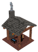 Кузня
Виробляє самопали. Потребує залізо.
### Потребується для будування
- 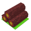 Дерево: 3

- 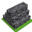 Каміння: 3

### Виробляє
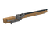 Самопал: 1

### Потребується у виробництві
-  Їжа: 2

- 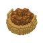 Руда: 1

-  Порох: 1

- ### Вміщує робочих: 30
---
#  Поле
Основний виробник їжі для вашого селища.
### Потребується для будування
-  Їжа: 5

### Виробляє
 Їжа: 1

### Потребується у виробництві

- ### Вміщує робочих: 50
---
#  Млин
Заробляє вам гроші. Люди приносять сюди збіжжя і платять вам гроші за борошно.
### Потребується для будування
-  Їжа: 5

-  Каміння: 5

-  Дерево: 5

### Виробляє
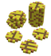 Гроші: 1

### Потребується у виробництві
-  Їжа: 5

- ### Вміщує робочих: 30
---
# 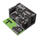 Каменярня
Виробляє каміння для будівництв.
### Потребується для будування
-  Їжа: 5

-  Дерево: 5

### Виробляє
 Каміння: 1

### Потребується у виробництві
-  Їжа: 2

- ### Вміщує робочих: 30
---
# 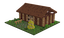 Конюшня
Виробляє коней. Вони необхідні козакам.
### Потребується для будування
-  Їжа: 5

-  Дерево: 5

### Виробляє
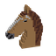 Коні: 1

### Потребується у виробництві
-  Їжа: 10

- ### Вміщує робочих: 30
---
# 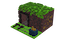 Рудня
Виробляє залізо для коваля.
### Потребується для будування
-  Їжа: 10

-  Дерево: 15

### Виробляє
 Руда: 1

### Потребується у виробництві
-  Їжа: 5

- ### Вміщує робочих: 30
---
# 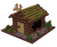 Хата уходника
Уходник ходить в ліс по дичину. Хутра можна продати за гарні кошти в Каневі.
### Потребується для будування
-  Їжа: 3

-  Дерево: 15

### Виробляє
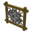 Хутра: 1

### Потребується у виробництві
-  Їжа: 5

- ### Вміщує робочих: 10
---
# 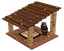 Пороховий льох
Виробляє порох для виробництва самопалів.
### Потребується для будування
-  Їжа: 5

-  Дерево: 5

-  Каміння: 2

### Виробляє
 Порох: 1

### Потребується у виробництві
-  Їжа: 3

- ### Вміщує робочих: 30
---
