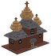
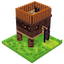

# Loca Deserta: Sloboda User Docs

# Resources
---
#  Smith

Produces firearms. Needs ore, powder and food.
### Required for building
-  Wood: 3

-  Stone: 3

### Output
 Firearm: 1

### Required for production by
-  Food: 2

-  Ore: 1

-  Powder: 1

- ### Max number of workers: 30

---
---
#  Field

The main food income resource.
### Required for building
-  Food: 5

### Output
 Food: 1

### Required for production by

- ### Max number of workers: 50

---
---
#  Mill

Earns you money by consuming food.
### Required for building
-  Food: 5

-  Stone: 5

-  Wood: 5

### Output
 Money: 1

### Required for production by
-  Food: 5

- ### Max number of workers: 30

---
---
#  Quarry

Produces stone used for building.
### Required for building
-  Food: 5

-  Wood: 5

### Output
 Stone: 1

### Required for production by
-  Food: 2

- ### Max number of workers: 30

---
---
#  Stables

Produces horses. They are used to convert citizens into cossacks.
### Required for building
-  Food: 5

-  Wood: 5

### Output
 Horse: 1

### Required for production by
-  Food: 10

- ### Max number of workers: 30

---
---
#  Iron Mine

Produces iron ore. It is used by the Smith to create firearms for cossacks.
### Required for building
-  Food: 10

-  Wood: 15

### Output
 Ore: 1

### Required for production by
-  Food: 5

- ### Max number of workers: 30

---
---
#  Trapper's Cabin

Hunter goes into the woods and catches the wild animals. Produces furs.
### Required for building
-  Food: 3

-  Wood: 15

### Output
 Fur: 1

### Required for production by
-  Food: 5

- ### Max number of workers: 10

---
---
#  Powder Cellar

Produces powder. It is used by the Smith to create firarms for cossacks.
### Required for building
-  Food: 5

-  Wood: 5

-  Stone: 2

### Output
 Powder: 1

### Required for production by
-  Food: 3

- ### Max number of workers: 30

---
---
# Town
---
#  House

House
### Required for building
-  Food: 10

-  Stone: 3

-  Wood: 10

### Output
 Citizens: 3

---
---
#  Church

Church
### Required for building
-  Food: 100

-  Stone: 20

-  Wood: 50

-  Money: 20

### Output
 Faith: 1

---
---
#  Tower

Tower
### Required for building
-  Food: 100

-  Stone: 20

-  Wood: 50

-  Money: 20

### Output
 Defense: 1

---
---
#  Watch Tower

Watch Tower
### Required for building
-  Food: 100

-  Stone: 20

-  Wood: 50

-  Money: 20

### Output
 Defense: 1

---
---
#  Wall

Wall
### Required for building
-  Food: 20

-  Wood: 100

### Output
 Defense: 1

---
---

