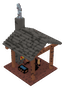
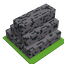
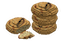
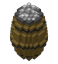
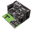
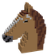
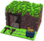
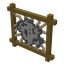

# Дике Поле: користувацька документація для гри Слобода

# Ресурси
---
#  Кузня

Виробляє самопали. Потребує залізо.
### Потребується для будування
-  Дерево: 3

-  Каміння: 3

### Виробляє
 Самопал: 1

### Потребується у виробництві
-  Їжа: 2

-  Руда: 1

-  Порох: 1

- ### Вміщує робочих: 30

---
---
#  Поле

Основний виробник їжі для вашого селища.
### Потребується для будування
-  Їжа: 5

### Виробляє
 Їжа: 1

### Потребується у виробництві

- ### Вміщує робочих: 50

---
---
#  Млин

Заробляє вам гроші. Люди приносять сюди збіжжя і платять вам гроші за борошно.
### Потребується для будування
-  Їжа: 5

-  Каміння: 5

-  Дерево: 5

### Виробляє
 Гроші: 1

### Потребується у виробництві
-  Їжа: 5

- ### Вміщує робочих: 30

---
---
#  Каменярня

Виробляє каміння для будівництв.
### Потребується для будування
-  Їжа: 5

-  Дерево: 5

### Виробляє
 Каміння: 1

### Потребується у виробництві
-  Їжа: 2

- ### Вміщує робочих: 30

---
---
#  Конюшня

Виробляє коней. Вони необхідні козакам.
### Потребується для будування
-  Їжа: 5

-  Дерево: 5

### Виробляє
 Коні: 1

### Потребується у виробництві
-  Їжа: 10

- ### Вміщує робочих: 30

---
---
#  Рудня

Виробляє залізо для коваля.
### Потребується для будування
-  Їжа: 10

-  Дерево: 15

### Виробляє
 Руда: 1

### Потребується у виробництві
-  Їжа: 5

- ### Вміщує робочих: 30

---
---
#  Хата уходника

Уходник ходить в ліс по дичину. Хутра можна продати за гарні кошти в Каневі.
### Потребується для будування
-  Їжа: 3

-  Дерево: 15

### Виробляє
 Хутра: 1

### Потребується у виробництві
-  Їжа: 5

- ### Вміщує робочих: 10

---
---
#  Пороховий льох

Виробляє порох для виробництва самопалів.
### Потребується для будування
-  Їжа: 5

-  Дерево: 5

-  Каміння: 2

### Виробляє
 Порох: 1

### Потребується у виробництві
-  Їжа: 3

- ### Вміщує робочих: 30

---
---
# Будівлі
---
#  Курінь

Курінь
### Потребується для будування
-  Їжа: 10

-  Каміння: 3

-  Дерево: 10

### Виробляє
 Люди: 3

---
---
#  Церква

Церква
### Потребується для будування
-  Їжа: 100

-  Каміння: 20

-  Дерево: 50

-  Гроші: 20

### Виробляє
 Віра: 1

---
---
#  Башта

Башта
### Потребується для будування
-  Їжа: 100

-  Каміння: 20

-  Дерево: 50

-  Гроші: 20

### Виробляє
 Рівень захисту: 1

---
---
#  Хфігура

Хфігура
### Потребується для будування
-  Їжа: 100

-  Каміння: 20

-  Дерево: 50

-  Гроші: 20

### Виробляє
 Рівень захисту: 1

---
---
#  Частокол

Частокол
### Потребується для будування
-  Їжа: 20

-  Дерево: 100

### Виробляє
 Рівень захисту: 1

---
---
