[Головна](../)

# Слобода. Стратегічна гра в стилі "розбудуй селище"

### Онлайн версія гри знаходиться за посиланням:

<a style="font-size: 26px" href="https://locadeserta.com/sloboda/">

Слобода Онлайн
</a>

### Версія для Android:

### Версія для iOS:

[Слобода APK](https://github.com/gladimdim/locadeserta/releases/download/sloboda-3.0.7/sloboda_307.apk)

### Версія для Windows:

[Скачати](https://github.com/gladimdim/locadeserta/releases/download/sloboda-3.0.7/sloboda_windows_307.zip)

### Розробницький блог:

[Дике Поле. Розробка гри.](https://hashnode.com/series/dike-pole-sloboda-ckhbo21jw04sto0s1e99rhld0)

## Основний ігролад

В цій грі ви будете виконувати обов'язки голови новозаснованої слободи десь на межі Великого Лугу. На початку гри вам дається невелика кількість ресурсів, пару десятків людей. Ваша задача — правильно розподілити роботу між людьми і починати створювати своє військо. Оскільки Великий Луг — це неспокійна місцина у XVI сторіччі, то вам прийдеться зіштовхнутися з нападами татар, рейдами ляхів, стихійними лихами. Тому треба якомога швидше поставити до лав своїх збройних козаків, які б могли брати участь у військових оказіях.

Гра основана на видачі задач різним будівлям. Наприклад, щоб озброїти козака, вам необхідно отримати самопал, коня і вільного робітника. Самопал в свою чергу потребує заліза і пороху. Побудувавши правильний виробничий ланцюг, ви зможете швидко наростити армію і вам відкриються спеціальні події. Також, можна відсилати козаків і гроші на Січ (центральний сервер) і виконувати різні задачі, які видаються на Січі.

## Синхронізація

Натиснувши кнопку "Синхронізація" ви зможете зберегти свою Слободу до центрального сховища. На іншому пристрої просто введіть згенерований 6-ти значний код (або придумайте його самі). На пристрої, де ви граєте найбільше, включіть автозбереження на хмару.

Головний екран

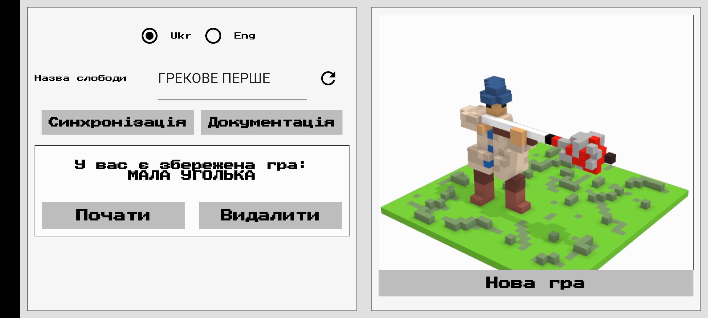

## Інтерфейс

## Економіка та ресурси

В грі наявна багаторівнева система виробництва. Для того, щоб створити якийсь складний товар, наприклад, самопал, необхідно видобути інші ресурси: залізо, порох та дерево. Поєднуючи ці три ресурси у заданих кількостях ви отримуєте самопал. Для виробництва необхідні робітники. На початку гри у вас є вільні робітники, яких ви можете посилати на роботу.

Кузня

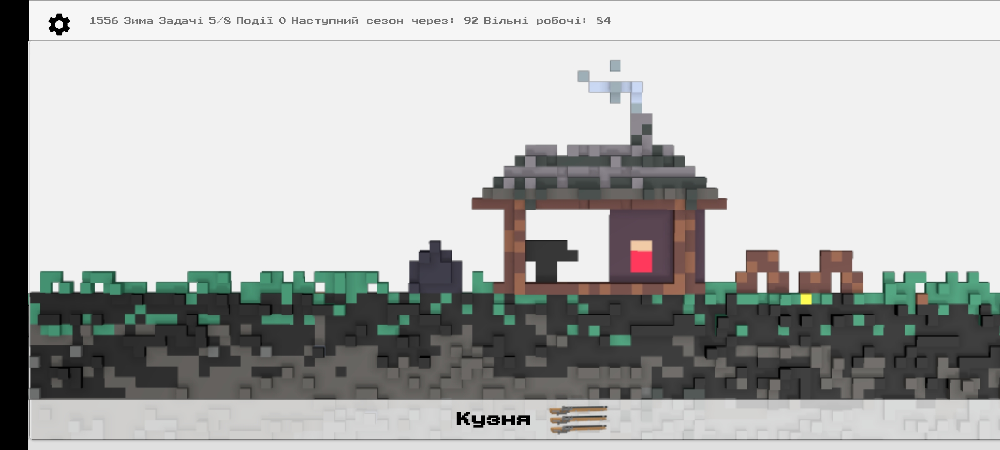

Щоб почати виробляти якийсь продукт, спочатку необхідно побудувати відповідну будівлю. Ліс та річка доступні завжди, їх не можна зруйнувати або побудувати.

Ліс та Річка

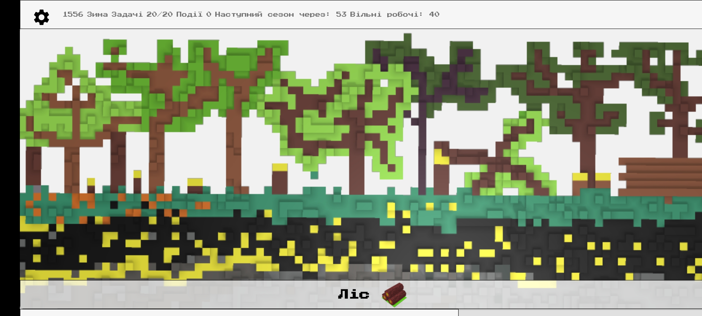
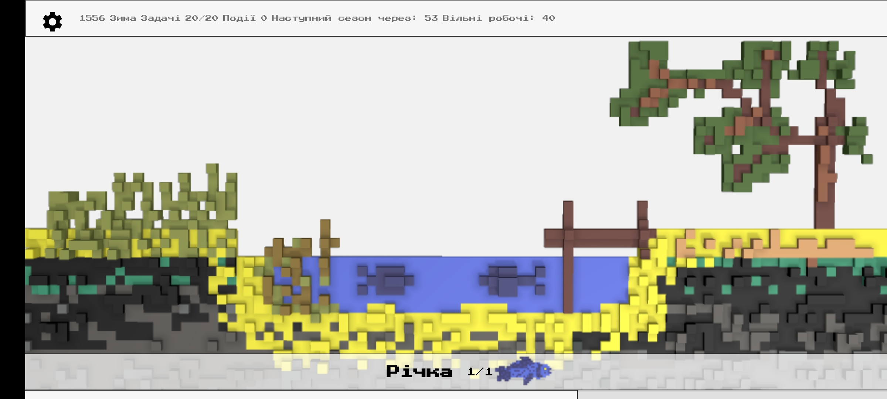

Кожна дія в слободі прискорює зміну сезону. Чим більше у вас виробництва, тим частіше будуть змінюватися сезони і роки.

Пороховий льох

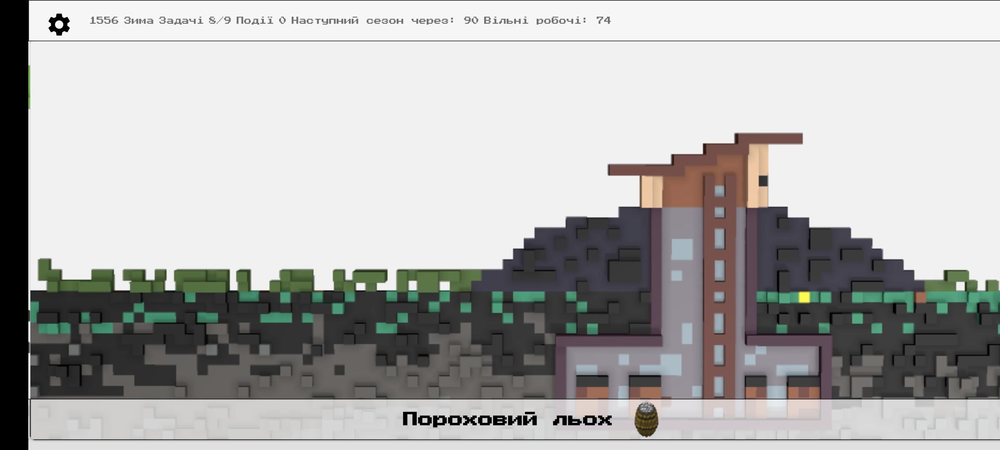

## Січ

Головний екран січі

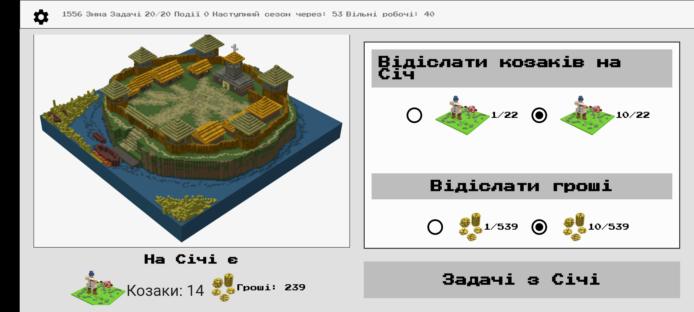

В грі є можливість відсилати допомогу козакам на Січ. Для цього потрібно лише вихід в Інтернет для зв'язку з серцем України. Січ являє собою центральне місце, куди надсилають допомогу абсолютно всі Слободи, в які грають. Тут ви можете подивитися, скільки всього допомоги уже було надіслано всіма гравцями в Слободу

### Задачі з Січі

Січ також містить список завдань, які кожна слобода може взяти для виконання. В грі ведеться реєстр всіх слобід і їх виконаних завдань, та незабаром буде дошка пошани.

Задачі з Січі

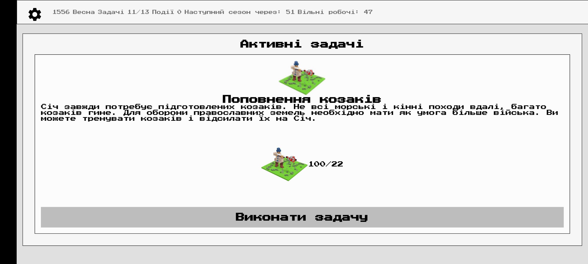

## Розбудова селища

Побудуйте курені, щоб до вас приєднувалося все більше вільних людей. За кожні декілька хвилин курінь дає +2 до кількості жителів. Спочатку краще накопичити дерева та їжі, а потім уже можна братися за побудову Церкви та обороних споруд. Також майте достатню кількість полів та додавайте туди якомога більше робітників. Їжі завжди не вистачає і вона потрібна в абсолютно усіх виробничих процесах.

Курінь, Церква та Башта

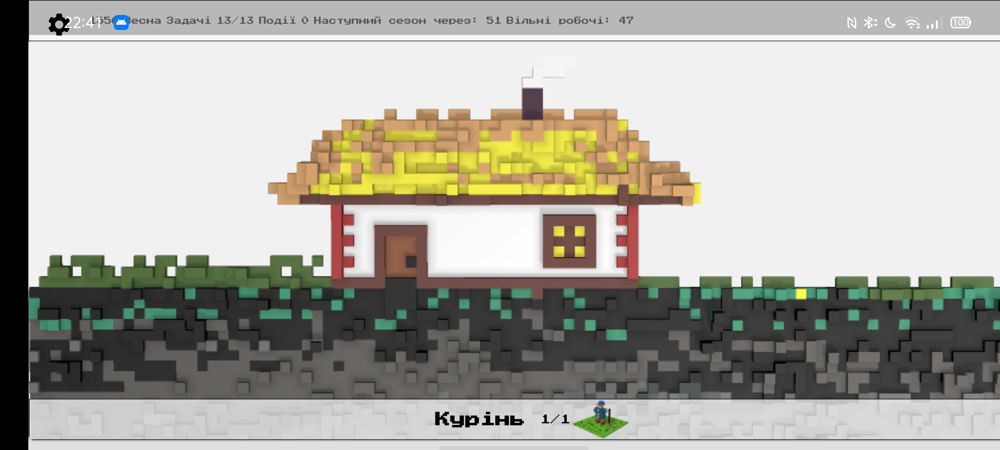
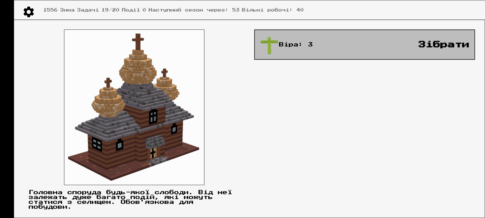
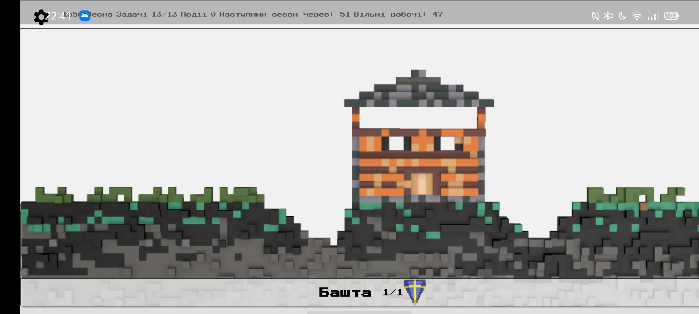

## Події

Однією з основних переваг даної гри є система подій. Всього в грі реалізовано 24 випадкові події. Залежно від прогресу вашого селища, гра буде генерувати різні випадкові події, в яких ви можете приймати участь. Також можуть створюватися події, на які ви ніяк не можете вплинути, наприклад, відвідини торговців (якщо у вас є достатньо товару).

Кожна з подій, залежно від показників слободи, може як принести вам вигоду (наприклад, більше людей приєднається до вас, чи знайдете диких коней в степу), або ж мати погані наслідки: атака на чамбул татар зазнала невдачі і ви втратили людей.

Прикладі подій і їх наслідки

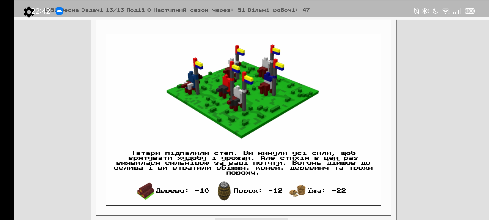
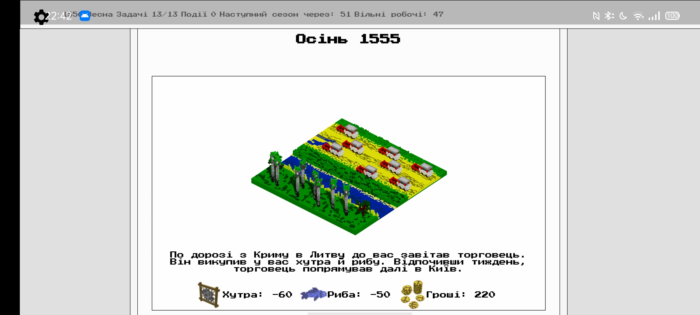

## Військові дії

Коли у вас розбудується Слобода у велике селище, то Кошовий з Січі буде вас запрошувати до участі у великих військових діях проти ляхів і турків або татар. Тримайте кількість козаків високою в селищі і не проґавте великий рейд до Криму!

Також робіть свої маленькі рейди на чамбули татар або завітайте до кривдників українського народу.

Питання події

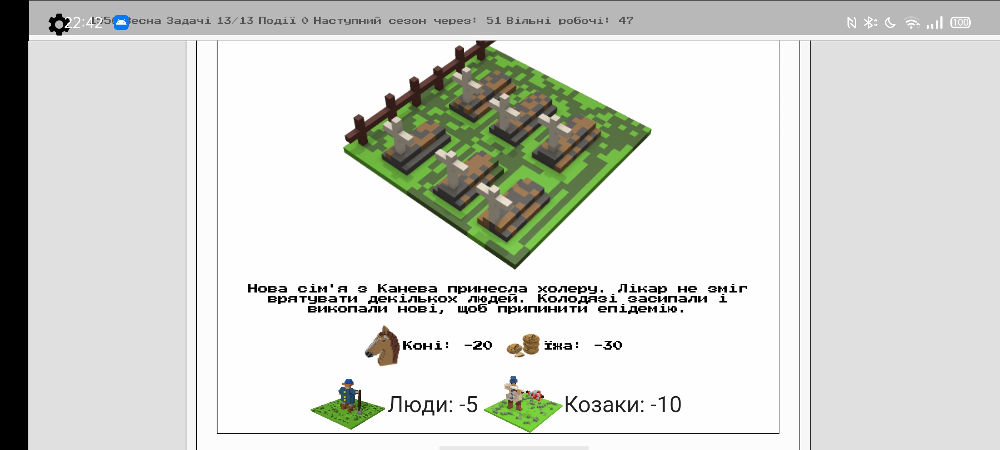

Козаки навчаються на Стрільбищі. Кожен козак вимагає чимало ресурсів, то ж краще спочатку створіть гарні економічні умови для великого загону.

Стрільбище, де тренуються козаки

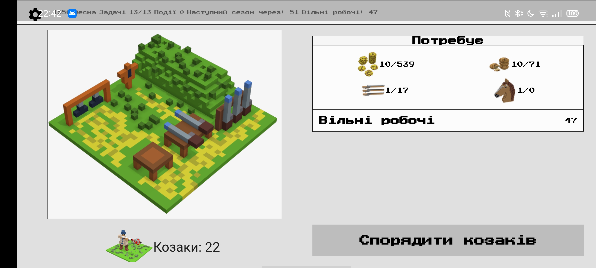

Але пам'ятайте, як тільки ви вишколили козака, він уже не зможе працювати на роботах, а може лише займатися військовими справами.
