[🇺🇸English](index_en.md)
[🇺🇦Українською](index.md)

# Слобода. Покрокова будівельна гра.

### Онлайн версія гри знаходиться по посиланню:

<a style="font-size: 26px" href="https://locadeserta.com/sloboda/">
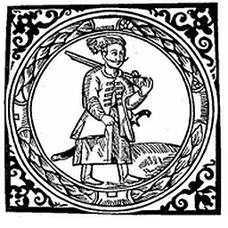
Слобода Онлайн
</a>

## Основний ігролад

В цій грі ви будете виконувати обов'язки голови новозаснованої слободи десь на межі Великого Лугу. На початку гри вам дається невелика кількість ресурсів, пару десятків людей. Ваша задача — правильно розподілити роботу між людьми і починати створювати своє військо. Оскільки Великий Луг — це неспокійна місцина у XVI сторіччі, то вам прийдеться зіштовхнутися з нападами татар, рейдами ляхів, стихійними лихами. Тому треба якомога швидше поставити до лав своїх збройних козаків, які б могли брати участь у військових оказіях.

Гра працює в покроковому режимі. Це означає, що ви робите якісь зміни у вашому селищі. Наприклад: додаєте на млин двох нових робітників, відсилаєте козаків у рейд, будуєте кузню Але наслідки цих дій наступлять лише після завершення ходу. Гра автоматично підраховує сальдо товарів, чи вистачає їжі для робітників, щоб вони могли створити відповідний товар і т.і.

Головний екран

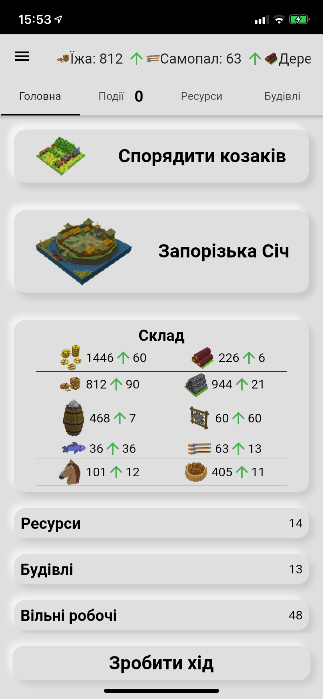

## Інтерфейс

## Економіка та Ресурси

В грі наявна багаторівнева система виробництва. Це означає, щоб створити якийсь складний товар, наприклад самопал, необхідно видобути інші ресурси: залізо, порох та дерево. В результаті поєднання цих трьох ресурсів у заданих кількостях ви отримуєте самопал. Для виробництва необхідні робітники. На початку гри у вас є вільні робочі, яких ви можете посилати на роботу.

Кузня

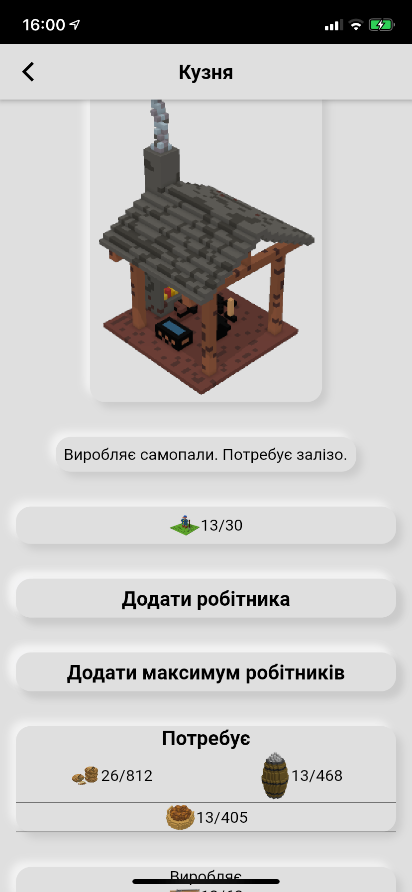

Щоб почати виробляти якийсь продукт, спочатку необхідно побудувати відповідну будівлю. Ліс та річка доступні завжди, їх не можна зруйнувати або побудувати.

Ліс та Річка

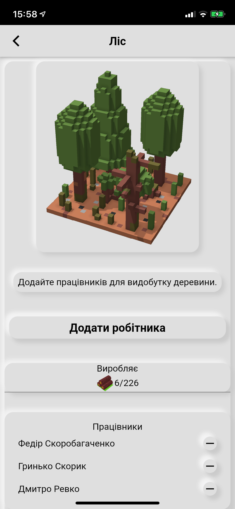
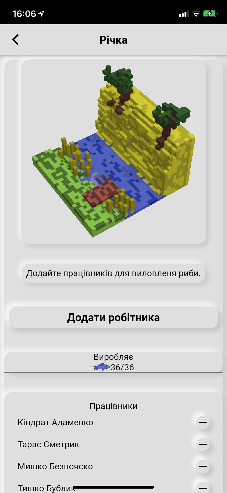

Під час початку нового ходу гра підраховує для кожної будівлі її потреби. Якщо селище може задовольнити вхідні ресурси, то будівля виробляє свій продукт. Якщо ж ні — то пропускає хід. Чим більше робітників працює в будівлі, там більше випускає продуктів, але і використовує теж більше.

Пороховий льох з 10 робочими

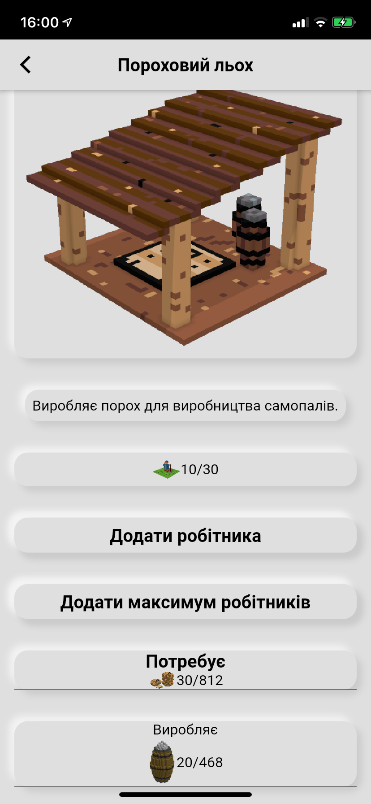

## Січ

Головний екран січі

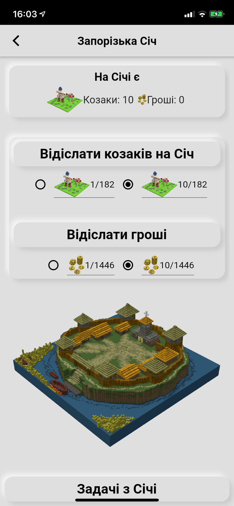
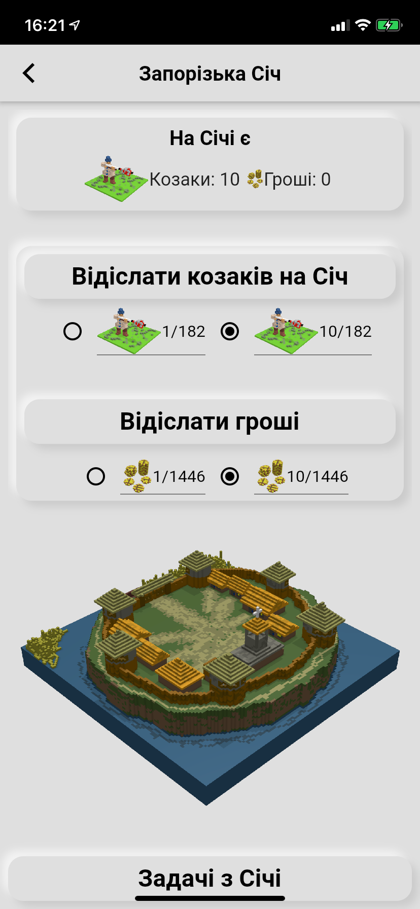
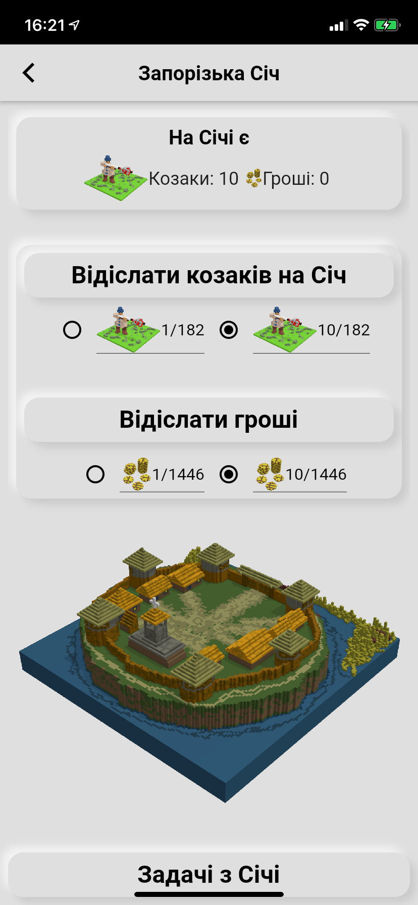
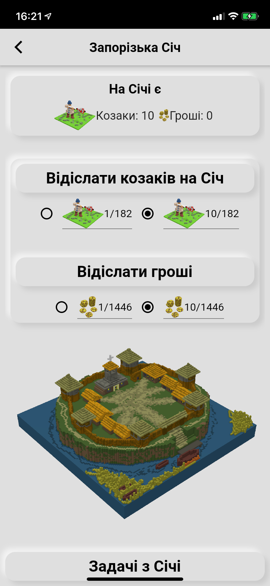

В грі є можливість відсилати допомогу козакам на Січ. Для цього потрібно лише вихід в інтернет для зв'язку з серцем України. Січ являє собою центральне місце, куди надсилають допомогу абсолютно всі слободи, в які грають. Тут ви можете подивитися скільки всього допомоги уже було надіслано всіма гравцями в Слободу.

### Задачі з Січі

Січ також містить список завдань, які кожна слобода може взяти для виконання. В грі ведеться реєстр всіх слобід і їх виконаних завдань і незабаром буде дошка пошани.

Задачі з Січі

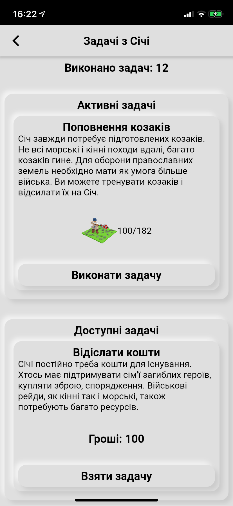

## Розбудова селища

Побудуйте курені, щоб до вас приєднувалося все більше вільних людей. З кожним ходом кожен курінь дає +3 до кількості жителів. Спочатку краще накопичити дерева та їжі, а потім уже можна приступати до побудови Церкви та оборонних споруд. Також майте достатню кількість полів та додавайте туди як змога більше робітників. Їжі завжди не вистачає і вона потрібна в абсолютно усіх виробничих процесах.

Курінь, Церква та Башта

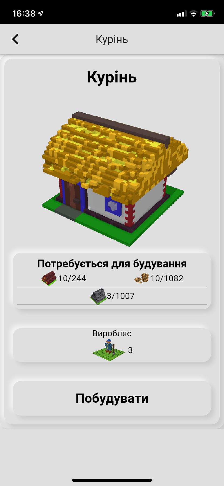
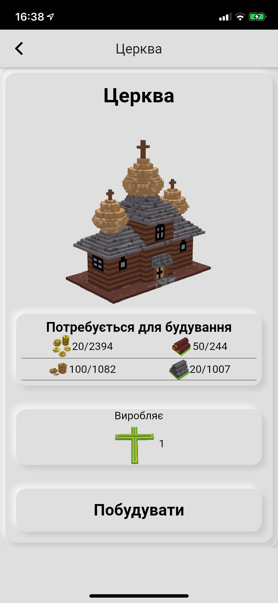
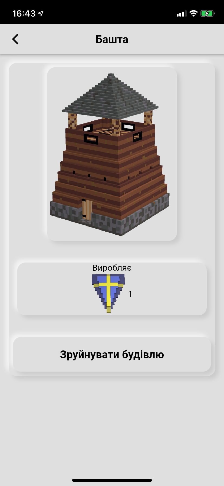

## Події

Однією з основних переваг даної гри являється система подій. Всього в грі реалізовано 24 випадкові події. В залежності від прогресу вашого селища, гра буде генерувати різні випадкові події, в яких ви можете брати участь. Також можуть створюватися події, на які ви ніяк не можете вплинути, наприклад, відвідини торговців (якщо у вас є достатньо товару):

Гості з Січі та купець з Литви

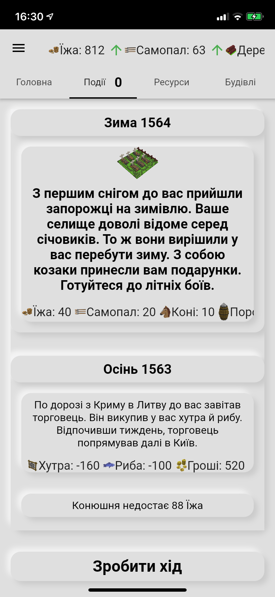

Кожна з подій, в залежності від показників слободи, може як принести вам вигоду, наприклад, більше людей приєднається до вас, або знайдете диких коней в степу, або ж мати погані наслідки: атака на чамбул татар зазнала невдачі й ви втратили людей:

Прикладі подій і їх наслідки

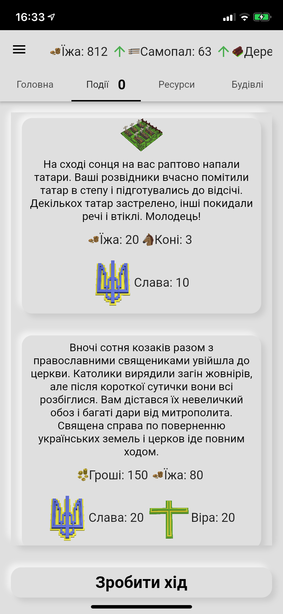
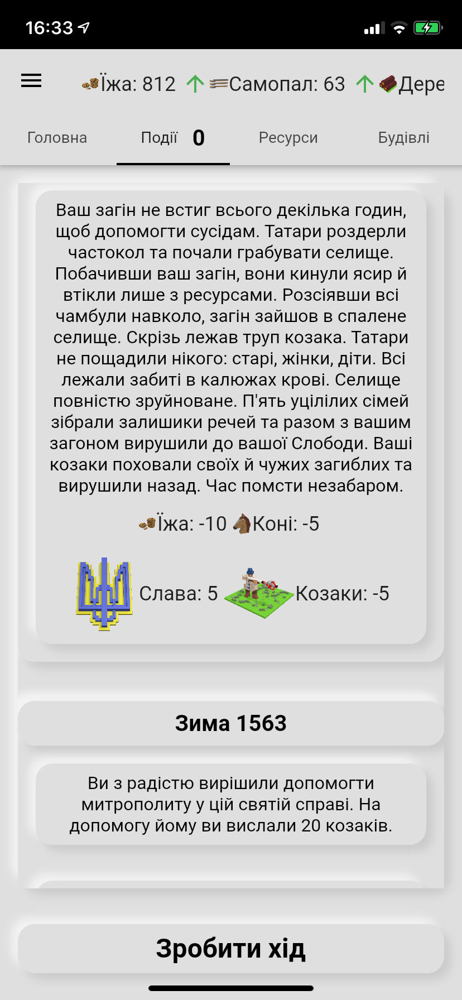

## Військові дії

Коли у вас розбудується Слобода у велике селище, то Кошовий з Січі буде вас запрошувати до участі у великих військових діях проти ляхів і турків або татар. Тримайте кількість козаків високою в селищі й не проґавте великий рейд до Криму!

Також робіть свої маленькі рейди на чамбули татар або завітайте до кривдників українського народу:

Питання події

Козаків треба тренувати на Стрільбищі. Кожен козак вимагає чимало ресурсів, то ж краще спочатку створіть гарні економічні умови для великого загону:

Стрільбище, де тренуються козаки

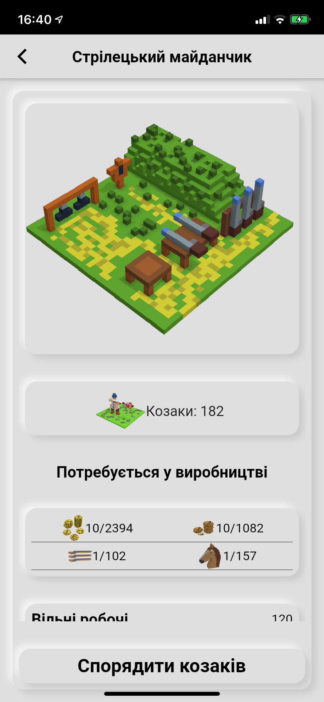

Але пам'ятайте, як тільки ви натренували козака, він уже не зможе працювати на роботах, а може лише займатися військовими справами.
