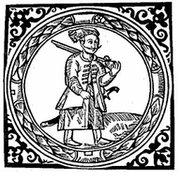
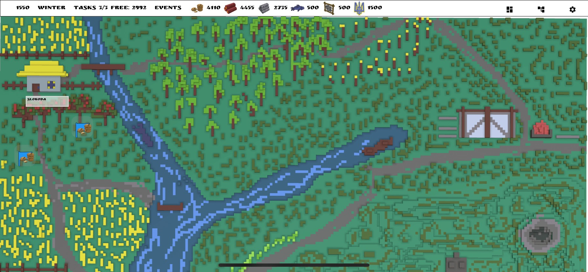
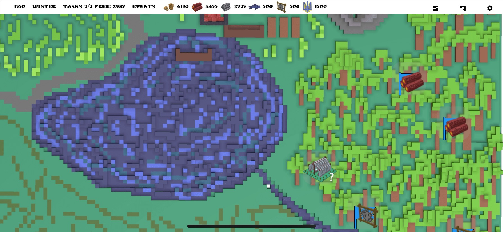
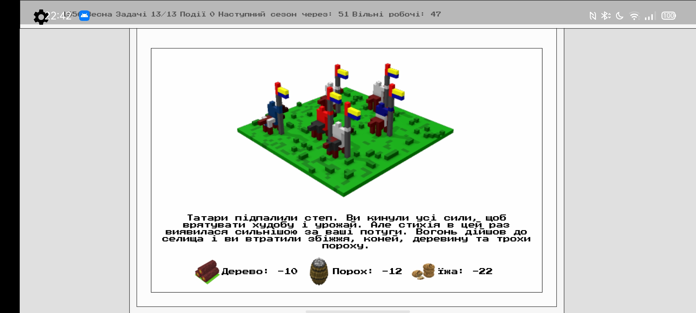
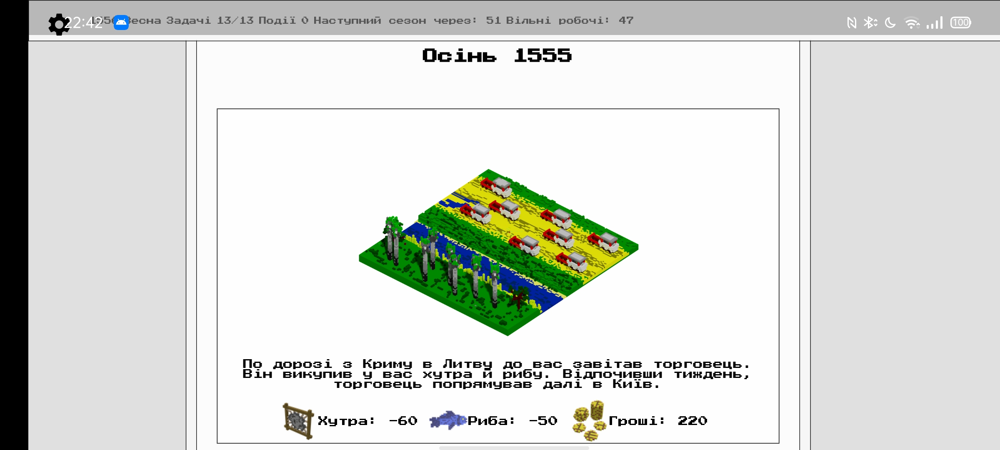
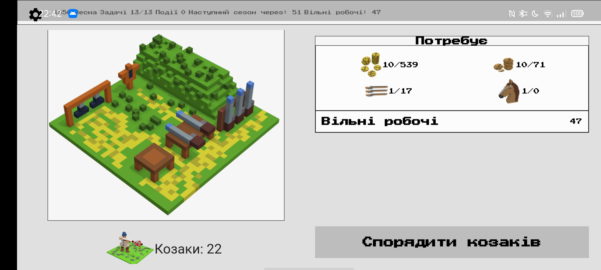

[Main page](../) / [🇺🇦Ukrainian](index.md)

# Sloboda. A City Building Game set in Ukraine XVI-XVII

Online version is available:

<a style="font-size: 26px" href="https://locadeserta.com/sloboda/">

Sloboda Online
</a>

### Android 🤖:

### iOS📱:

### Android APK download:
[Sloboda APK](https://github.com/gladimdim/locadeserta/releases/download/sloboda-3.0.7/sloboda_307.apk)

### Windows download:

[Download](https://github.com/gladimdim/locadeserta/releases/download/sloboda-3.0.7/sloboda_windows_307.zip)

### Developers blog:

[https://gladimdim.org](https://gladimdim.org)

# Gameplay

## Intro
In this game you will lead the newly formed settlement in the lands of Loca Deserta. This is a rural hostile environment located between lands of Sich and Crimea.

## Economy
At the very beginning you have some resources that you have to invest into developing economy. Such as: building Mill, Mines, Stables.

The economy is quite sophisticated. For example, to get a cossack (army unit), you have to get 1 horse, 1 firearm, gold and food. To get 1 firearm you need iron, wood and powder. To get iron you need food. To get food you need grains...you get the idea.

## Maps
The game has two hand crafted maps: Outer map and the big Map of Sich Lands. On the outer map you can find different events, such as helping merchants, getting fur from hunting bears or even finding treasures. Keep an eye on the map each season change.

# User Interface

Main View

## Economy and Resources

As mentioned, the game has a multi-level production chain system. Each task requires free workers to be available.

Smith

To start making some product you have to build the building that can produce it. Forest, Field and River require 0 resources.

Forest and River

Each action in the game accelerates season change. The more you have produced the faster next season comes.

Powder Cellar

## Expanding your Sloboda

Kurin (house) keeps generating new workers each minute. You can upgrade this building first in order to get more workers. After that you can upgrade Forest and Mill with Field. This will ensure that you get more vital resources that are required almost in all tasks.

Kurin, Church

## Maps
There are two maps handcrafted for this game: Outer map and Sich Map. 

### Outer Map

Outer map allows you to get very cheap resources quite quickly. For this you just need to dispatch workers to pick resources on the map. You can also find different secrets: treasures, interactive fiction stories, other events.

Outer map overview

Resource Spot

Gathering

Multiple Spots

Map Event

### Sich Lands Map

This map has many other settlements available for trade. But at first you have to settle them.

Sich Map

Capturing new spots

Trading with spots

By capturing new spots you expand the your lands and can capture more and more. To protect your settlements you have to occupy military points - Scout Towers in steppe. They open huge radius of a map and allow to proceed quite quickly. Each spot on the map has unique history and provides lucruative trade rates.

Unique spot trade

## Events

One of the main features of this game is event system. Depending on your actions and stats of your Sloboda different events are activated. Say you got a lot of gold but not your army is weak. Then Tartars might plunder your settlement and you can lose buildings and resources. If you have a Church then you have a very high probability of nearby settlements join forces with you.

The result event can be either positive or negative for you. For example, the Tartars can attack you in the field but due to your stats you can still win the battle and get benefits by plundering resources and gold.

Examples

## Battles

When your Sloboda becomes large, you will start getting more events that require large armies. You will also start using scouts to track the tartar forces and destroy them.

Result of the event

Cossacks are trained at Shooting Range. You can train free worker to become a cossack. You cannot make him a worker after that. Each cossack requires some resources, so it is better to have a stable economy.

Shooting Range

## Seasons gameplay
Seasons in the game reflect nature: Winter, Spring, Summer, Autumn. Each action you do in Sloboda costs some points. Once you reach 100 points the season changes. The new events are generated on maps. The results from previous events are available for you as well.

## Synchronization between devices

In the main menu you can open Sync view. Provide some key that you can remember and hit Upload. The game is saved to the central server. Now open this game on another device, go to Sync view and enter your private key. Your game will be restored on this device.

Pay attention to have only one game with auto sync on!
