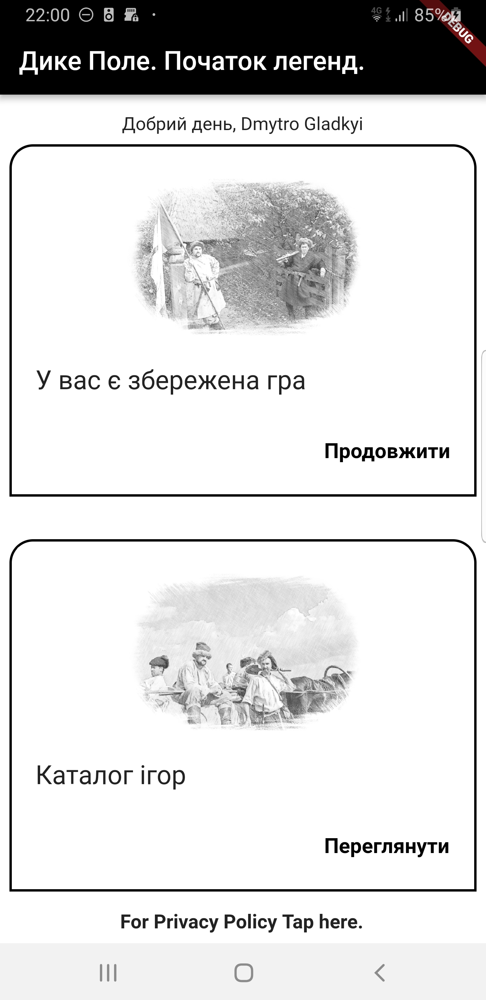
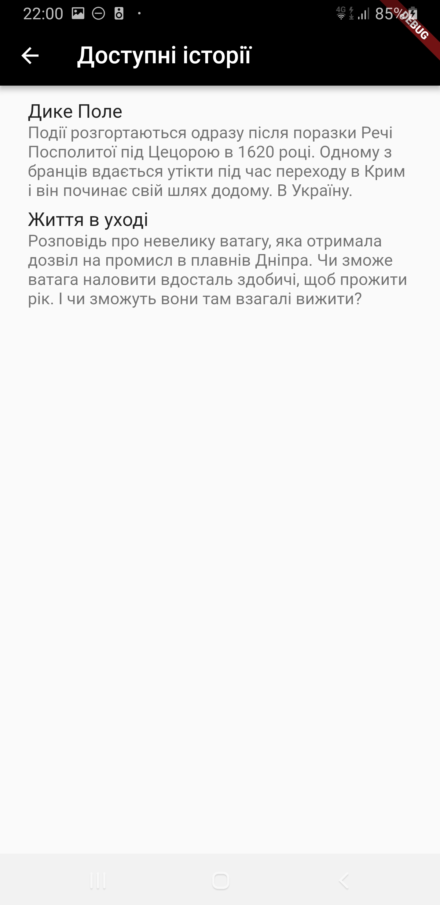
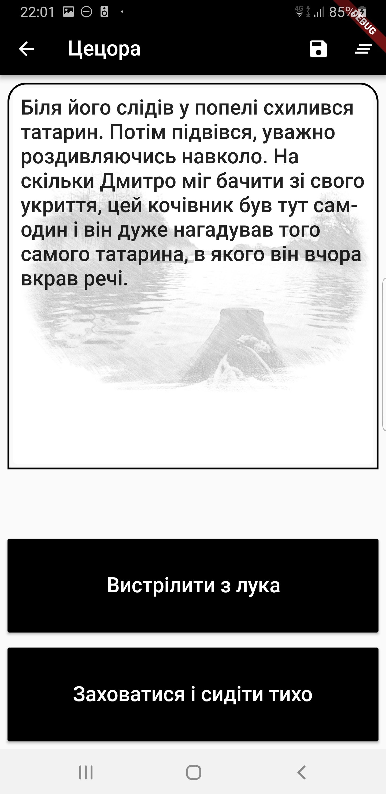
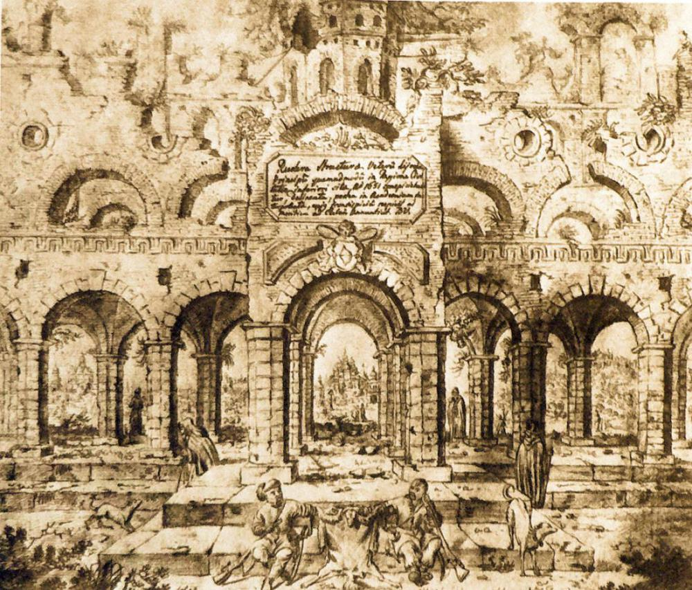

[🇺🇸English](index_en.md)
[🇺🇦Українською](index.md)
[🇵🇱Polski](index_pl.md)

# Дике Полe
# Що це

Інтерактивна гра-книга (Interactive Fiction). Гра дозволяє зануритись в бурхливі події 1620х років, які відбувалися на Дикому Полі. Але ви не тільки читаєте історію, а ще і можете вибирати подальший розвиток подій. В залежності від вашого вибору, історія продовжується в різних напрямах, або ж і просто обривається назавжди...

# Про що книга

Тільки-но закінчилась битва під Цецорою. Турецьке-кримське військо розбило армію Речі Посполитої. Серед бранців опинився і головний герой - Дмитро. Йшла осінь 1620 року. Дмитро зміг втекти з полону під час переходу до Криму.Лежачи на березі Дніпра, серед очерету, він починає свій шлях. Назад в Україну.

## Коли можна буде пограти

Випуск гри заплановано на 1 червня 2019 року.

## Альфа версії

Уже зараз ви можете отримати альфа версії, для цього звертайтесь до gladimdim@gmail.com. В темі укажіть "Alpha Access".

***Альфа версії виглядають так:***

  
  
  

## Хто цим займається

Продуктом займається Гладкий Дмитро та Бойцов Костянтин

## Як допомогти?

Якщо вмієте малювати в стилі: 

  

 і хочете допомогти, то пишіть на gladimdim@gmail.com

## Де купити фігурки?

Ми плануємо запустити продаж мініатюр з головними героями книги. Поки що нічого конкретного, але буде :-)

