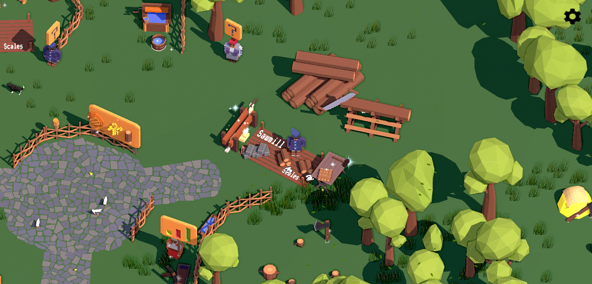
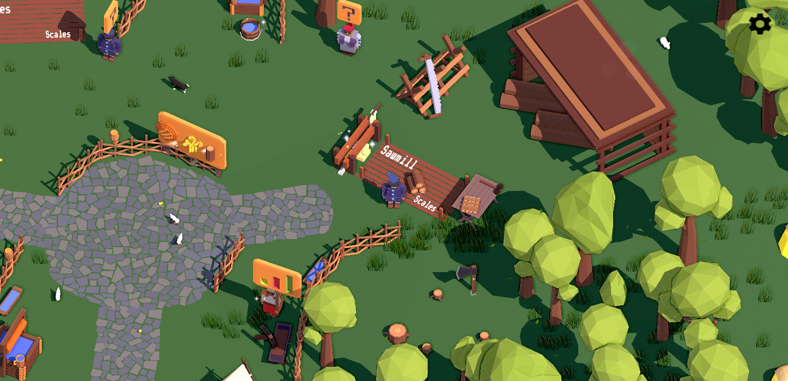

[🇺🇦 Українською](index_uk.md)

[Other Games](all_games.md)

# Sloboda. Build a settlement in XVII century

# About the Game

Loca Deserta is a strategy game that puts you in the role of the head of a freshly settled town in southern Ukraine. Your mission is to gather resources, build manufacturing facilities, open up new valleys, and gain access to the Black Sea. You'll face a variety of challenges as you work to turn your town into a thriving metropolis.

The game takes place in the wild lands of southern Ukraine, an area known for its rugged terrain and unforgiving climate. Despite the challenges, you are determined to make a new life for yourself and your people.

As you play, you'll take on quests that guide you through the gameplay mechanics. You'll need to manage your resources carefully in order to build the town's infrastructure and keep your citizens fed and happy. You'll also need to establish a variety of production chains, from agriculture and fishing to mining and manufacturing.

With more than 40 buildings to construct, 14 production chains to manage, and dozens of animations, Loca Deserta offers a rich and immersive gameplay experience. The game's low-poly art style gives it a charming and unique look, while the intricate mechanics will keep you engaged for hours on end.

Can you turn a small settlement into a thriving town in the wilds of southern Ukraine? Play Loca Deserta to find out!

# Links

- Tiktok

- Twitter: [https://twitter.com/locadeserta](https://twitter.com/locadeserta)
- Telegram: [https://t.me/locadesertachumaki](https://t.me/locadesertachumaki)

## The game is done in two genres

- 🏠 build a settlement, or city-building
- ⚒️ production simulation

## What's the city building genre?

In this genre players build settlements somewhere in wild lands. They start with primitive tools and resources like logs or stones picked on the map. Something like Minecraft but not as a first person :-). Slowly players build manufacturings that allow production of more sophisticated materials and goods like cannons, metal, ships, etc. Each building can be upgraded three times to increase the output. 

Each building in game has unique lowpoly style with three levels of upgrades.

Take an example, Sawmill 🪚. Three levels of buildings all different but recognizable:

 ➡️  ➡️ 

## What's about production simulation?

In this genre players have to form a production chain flow of primitive goods to be processed into something more sophisticated.

## Licenses

Sloboda 2 contains materials licensed under appropriate licenses as seen at: [Licenses](sloboda2_licenses.html)

## Game has full external gaming controller support 🎮

