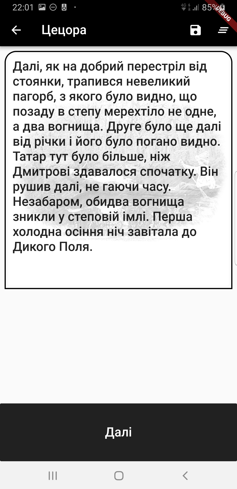

[🇺🇸English](index_en.md)
[🇺🇦Українською](index.md)
[🇵🇱Polski](index_pl.md)

# Loca Deserta

# What is this

Interactive Fiction. This game allows to dive into heroic epoch in XVII century, which took part in the southern part of Ukraine, at Loca Deserta. You not only read the story but you can select how it proceeds further! Depending on your selections you can get absolutely different events, encounters. Or you can even die.

# About the book

The story starts just after the [Battle of Cecora](https://en.wikipedia.org/wiki/Battle_of_Cecora_(1620)) is finished. Turkish-crimean army won the battle against Rzecz Pospolita. One of the prisoners of war is our hero - Dmytro. It was an autumn in 1620 year. Dmytro could escape while he was moved to Crimea. The story starts when Dmytro starts his journey back home, back to Ukraine.

**Game will be available in Ukrainian, English and Polish languages**

## When will it be ready?

We plan to beta release the game on 1st of June 2019

## Alpha Version

You can get the invite to alpha version (for Android) by emailing us at locadeserta@gladimdim.org. Topic: "Alpha Access".

***Alpha versions:***

## Who we are

Product is developed by Dmytro Gladkyi and Boytsov Kostyantin

## How can we help?

If you can make such sketches:  and want to help, then write email to gladimdim@gmail.com

## Where to buy miniatures?

We plan to 3D print main characters of this book. Stay tuned.

