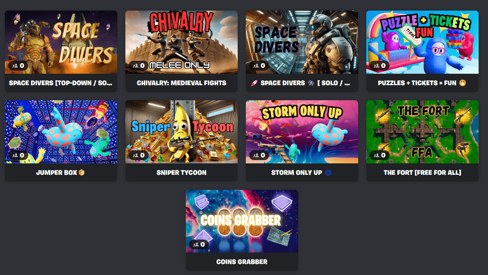
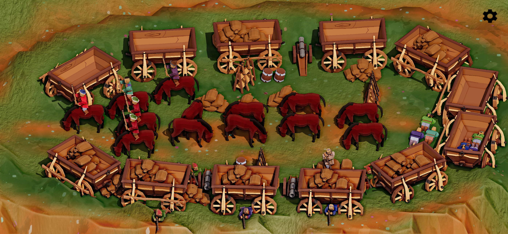
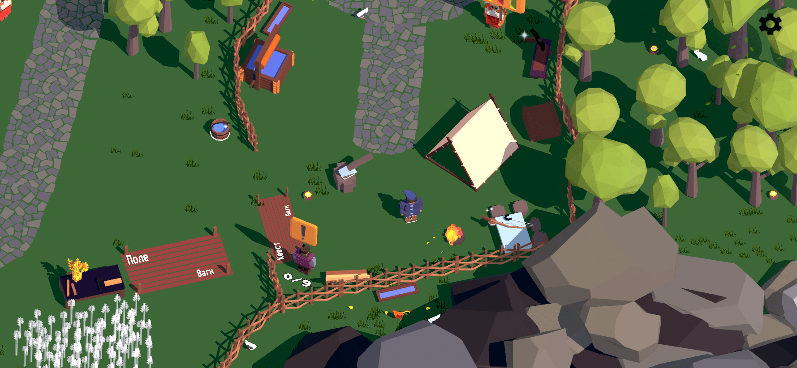
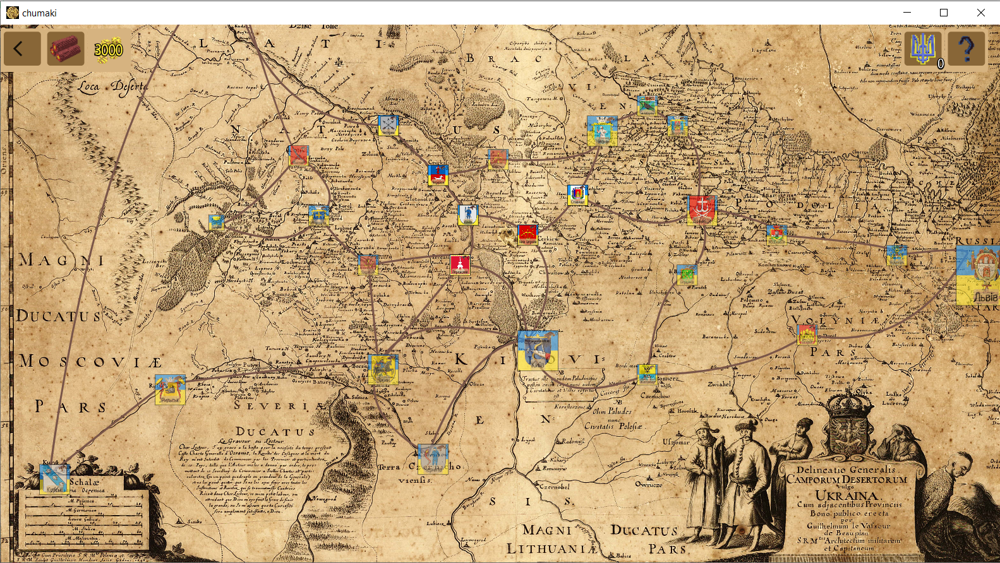
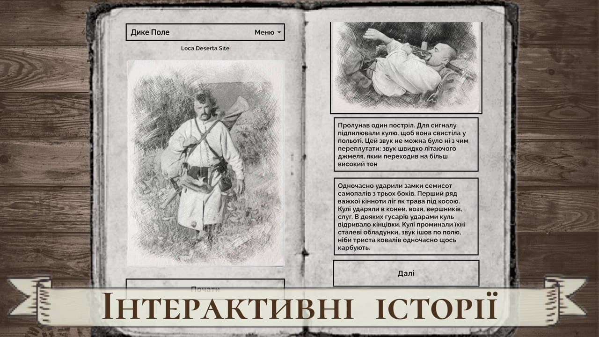
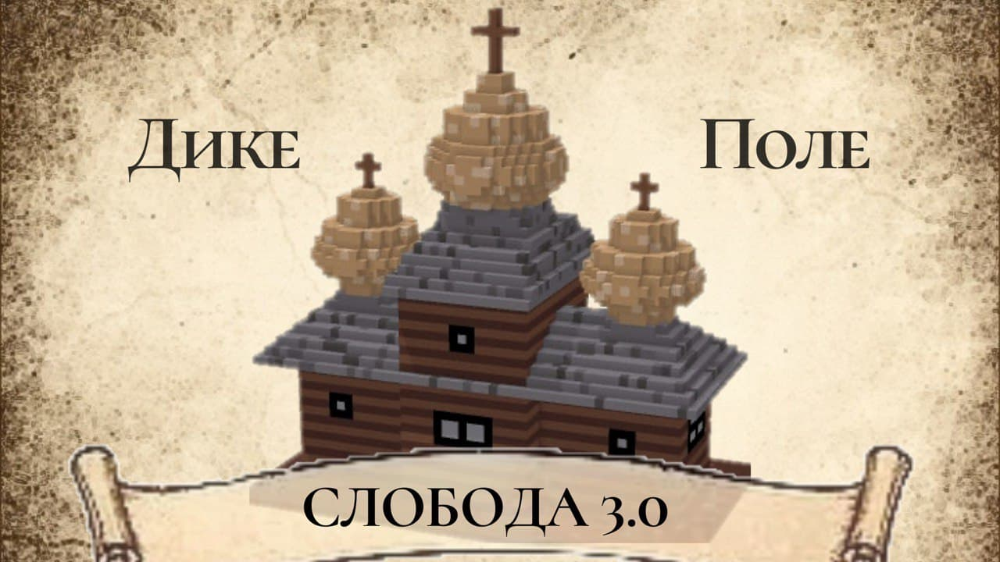

[🇺🇦Українською](index.md)

# Loca Deserta Game Universe!

    

## Jul 31, 2026

Released the third book in the Loca Deserta Sci-Fi universe — **«Vistrya Kulaku» (Fist's Edge)**! A story about the Hetmanate Federation terminators, orbital drops, and brotherhood forged in vacuum and plasma.

[📖 Read on the site (UA)](/locadesertascifi/books/Vistrya_Kulaku.html) | [📚 Booknet (UA)](https://booknet.ua/book/vstrya-kulaku-b457200) | [🍎 Apple Books](http://books.apple.com/us/book/id6796759290) | [⬇️ GitHub (EPUB)](https://github.com/gladimdim/locadeserta/releases/tag/vistrya_kulaku)

Also released another book — **«Zustrich v Stepu» (Encounter in the Steppe)**! A story about scout platoons on planet Dyke Pole-17, bot-horses, and Cossack brotherhood behind enemy lines.

[📖 Read on the site (UA)](/locadesertascifi/books/Zustrich_v_Stepu.html) | [📚 Booknet (UA)](https://booknet.ua/book/zustrch-v-stepu-b446432) | [🍎 Apple Books](http://books.apple.com/us/book/id6796818751) | [⬇️ GitHub (EPUB)](https://github.com/gladimdim/locadeserta/releases/tag/encounter_in_steppe)

## Jul 14, 2026

A new game in the Loca Deserta Sci-Fi universe — **Loca Deserta: Settlers**! A macro-economic space colony builder inspired by The Settlers III/IV: harvest asteroids, chain production buildings, expand your territory with Towers, and colonise planets named after Ukrainian places — Podillia, Zhovti Vody, Kryvbas.

Play for free right in your browser: [settlers.locadeserta.com](https://settlers.locadeserta.com)

Windows, macOS, and Linux builds: [download from GitHub Releases](https://github.com/gladimdim/LocaDeserta_Settlers/releases)

## Jan 3, 2025

Loca Deserta is coming to Roblox!

We are glad to announce that we have decided to make next game from the Loca Deserta game universe in Roblox!
This will be a multiplayer team-based shooter game with objectives on a map! Follow us on social medias or jump directly into the daily dev build:

[Loca Deserta @ Roblox ](https://www.roblox.com/games/105150009083536/Loca-Deserta-DEV-0-0-5)

[Loca Deserta @ Roblox Community](https://www.roblox.com/communities/35449027/Loca-Deserta-Games#!/about)

[Loca Deserta Games @ Guilded](https://www.guilded.gg/i/EA3wamqk)

## Our Fortnite Games. Seach by author [@DmytroGladkyi](https://www.fortnite.com/@dmytrogladkyi)

We have published 9 different Fortnite Islands, including games from our new universe - Loca Deserta Sci-Fi.

<a style="font-size: 36px" href="https://www.fortnite.com/@dmytrogladkyi">All Our Games from Fortnite
  

 
  

</a>

<iframe src="https://store.steampowered.com/widget/2637950/" frameborder="0" width="646" height="190"></iframe>

## So far, we have published 6 games on Mobiles and Steam. Check them out!

<a style="font-size: 36px" href="./odesa/index">Loca Deserta: Odesa. Build. Craft. Explore!
  

 
  

</a>

---

<a style="font-size: 36px" href="./sloboda2/index">Loca Deserta: Sloboda 2. Build and Craft in Lowpoly World!
  

 
  

</a>

--- 

<a style="font-size: 36px" href="locadesertachumaki/index_en">Loca Deserta: Chumaki. A trader simulator in Ukrainians lands.
  

 
  

</a>

---

<a style="font-size: 36px" href="interactive/index_en">Interactive Fiction About Ukraine in XVI-XVII
  

    
  

</a>

---

<a style="font-size: 36px" href="citybuilding/index_en">Loca Deserta: Sloboda. A City Building Game.
  

    
  

</a>

---

<a style="font-size: 36px" href="locadesertahex/index_en">Loca Deserta: Hex. A Puzzle Game.
  

 
  

</a>

