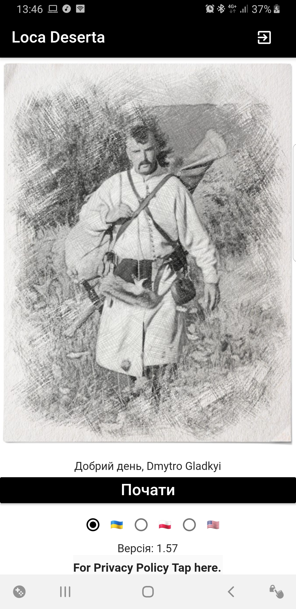

[🇺🇸English](index_en.md)
[🇺🇦Українською](index.md)
[🇵🇱Polski](index_pl.md)

# Loca Deserta

# What is this

Interactive Fiction. This game allows to dive into heroic epoch in XVII century, which took part in the southern part of Ukraine, at Loca Deserta. You not only read the story but you can select how it proceeds further! Depending on your selections you can get absolutely different events, encounters. Or you can even die.

# About the book

At the beginning of XVII century a confrontation flares up between Polish-Lithuanian Commonwealth and Ottoman Empire. As a result of a devastating defeat in the Battle of Cecora, a lot of noblemen, cossacks and soldiers perished or were captured by Turks and Tatars. A fate of a young cossack, wayfaring through the Wild FIelds in a desperate attempt to escape from captivity, depends on a reader of this interactive fiction. All challenges are equally hard: survive in a steppe, avoid the revenge of Tatars, win the trust of cossack fishermen and return home. But the time of the final battle that will change history is coming. Will the main character be able to participate in it and stay alive and where his life will go from there - only You know the answer.

**Game will be available in Ukrainian, English and Polish languages**

## Download now!

  
  
  

## Who we are

Product is developed by Dmytro Gladkyi and Boytsov Kostyantin

## How can we help?

If you can make such sketches: 

  

and want to help, then write email to gladimdim@gmail.com

## Where to buy miniatures?

We plan to 3D print main characters of this book. Stay tuned.

