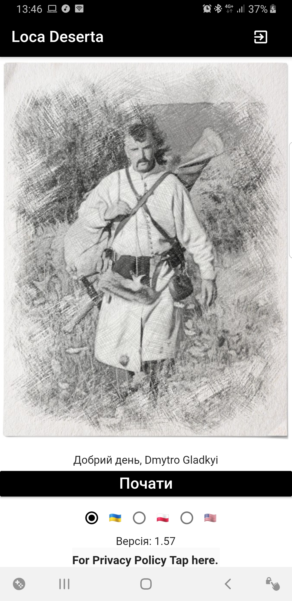
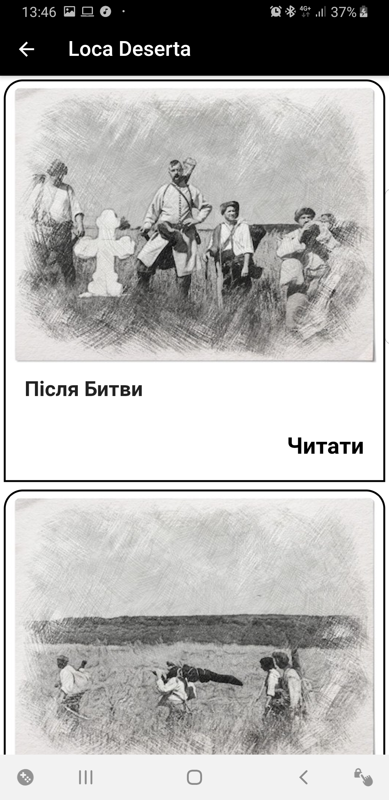
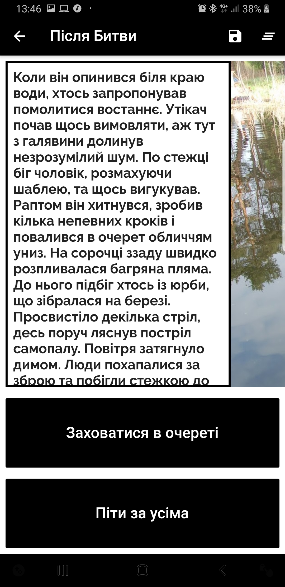

[🇺🇸English](index_en.md)
[🇺🇦Українською](index.md)
[🇵🇱Polski](index_pl.md)

# Loca Deserta (Dzikie Pole)

# Co to jest

Interaktywna fikcja. Ta gra pozwala zanurzyć się w heroicznej epoce w XVII wieku, która odbyła się w południowej części Ukrainy, w Loca Deserta. Nie tylko czytasz historię, ale możesz wybrać, jak dalej będzie postępować! W zależności od wyboru możesz uzyskać zupełnie inne wydarzenia, spotkania. Albo możesz nawet umrzeć.

# O książce

Na początku XVII wieku dochodzi do konfrontacji Imperium Osmańskiego i Wspólnoty Narodów. Podczas ciężkiej klęski w bitwie Cetzer wielu szlachciców, kozaków i rybaków zostało schwytanych lub schwytanych przez Turków i Tatarów. Od czytelnika tej interaktywnej opowieści zależy, jak los młodego Kozaka, który rozpaczliwie próbuje uciec z niewoli tatarskiej, udaje się do Dzikiego Pola. Aby przetrwać w stepie, uniknąć zemsty tatarskiej, polegać na zaufaniu pielęgniarek kozackich i powrócić do domu - równie trudne testy. Nadchodzi jednak czas decydującej bitwy, która zmieni bieg historii. Czy bohater będzie mógł wziąć w niej udział i nie zginąć, a w jaki sposób pójdzie na własne życie - tylko ty możesz odpowiedzieć na te pytania.

** Gra będzie dostępna w językach ukraińskim, angielskim i polskim **

## Pobierz teraz!

  
  
  

## Kim jesteśmy

Produkt został opracowany przez Dmytro Gladkyi i Boytsov Kostyantin

## Jak możemy pomóc?

Jeśli możesz zrobić takie szkice:

  

 i chcesz pomóc, napisz e-mail na adres gladimdim@gmail.com

## Gdzie kupić miniatury?

Planujemy wydrukować 3D głównych bohaterów tej książki. Bądźcie czujni.
