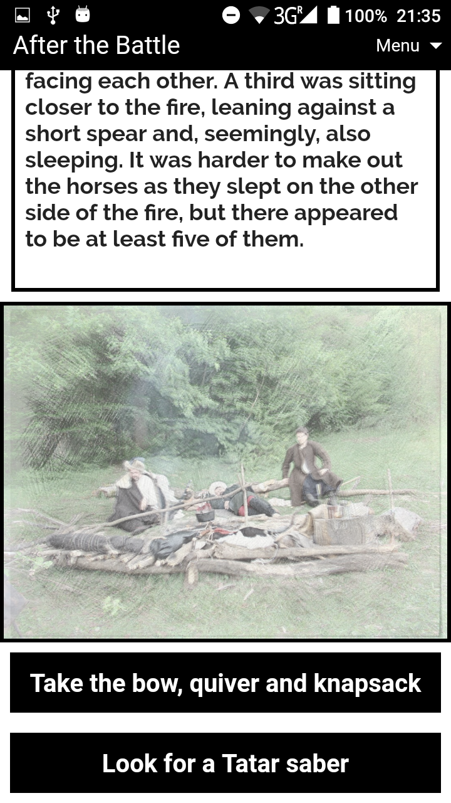
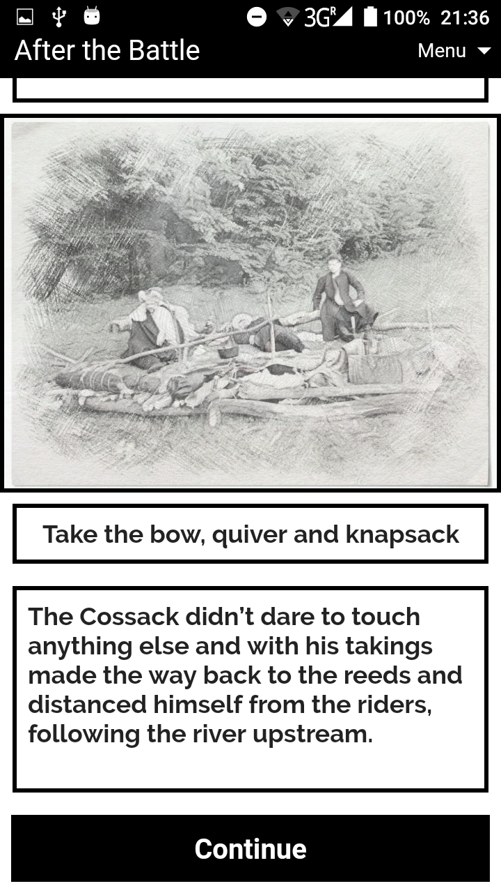

[🇺🇸English](index_en.md)
[🇺🇦Українською](index.md)
[🇵🇱Polski](index_pl.md)

# Loca Deserta (Dzikie Pole)

# Co to jest

Interaktywna fikcja. Ta gra pozwala zanurzyć się w heroicznej epoce w XVII wieku, która odbyła się w południowej części Ukrainy, w Loca Deserta. Nie tylko czytasz historię, ale możesz wybrać, jak dalej będzie postępować! W zależności od wyboru możesz uzyskać zupełnie inne wydarzenia, spotkania. Albo możesz nawet umrzeć.

# O książce

Historia zaczyna się tuż po zakończeniu [Bitwy o Cecora] (https://en.wikipedia.org/wiki/Battle_of_Cecora_ (1620)). Wojsko turecko-krymskie wygrało bitwę przeciwko Rzeczowi Pospolita. Jednym z jeńców wojennych jest nasz bohater - Dmytro. Była jesień w 1620 roku. Dmytro mógł uciec, gdy został przeniesiony na Krym. Historia zaczyna się, gdy Dmytro rozpoczyna swoją podróż z powrotem na Ukrainę.

** Gra będzie dostępna w językach ukraińskim, angielskim i polskim **

## Kiedy to będzie gotowe?

  
  
  
  

## Kim jesteśmy

Produkt został opracowany przez Dmytro Gladkyi i Boytsov Kostyantin

## Jak możemy pomóc?

Jeśli możesz zrobić takie szkice:

  

 i chcesz pomóc, napisz e-mail na adres gladimdim@gmail.com

## Gdzie kupić miniatury?

Planujemy wydrukować 3D głównych bohaterów tej książki. Bądźcie czujni.
