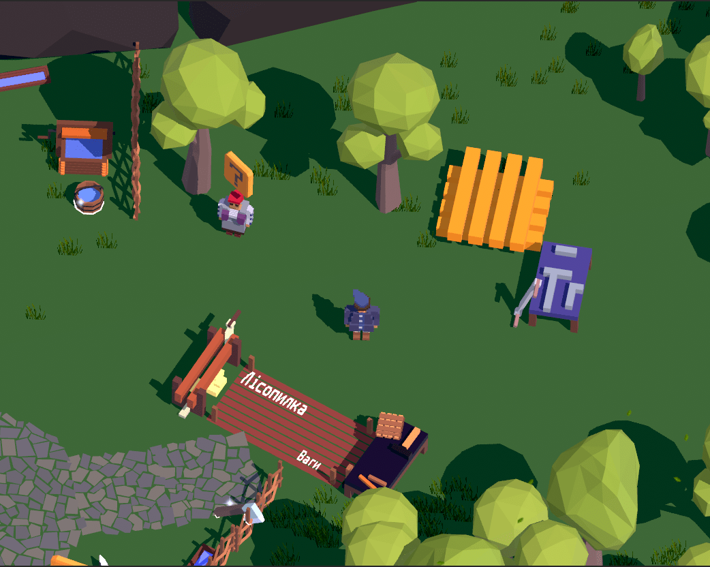
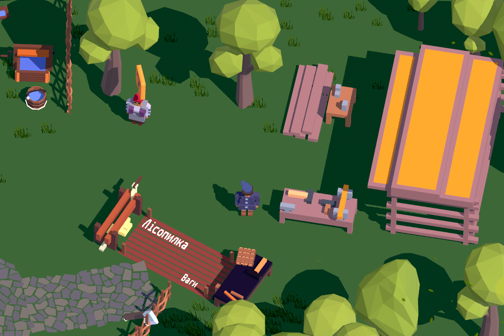
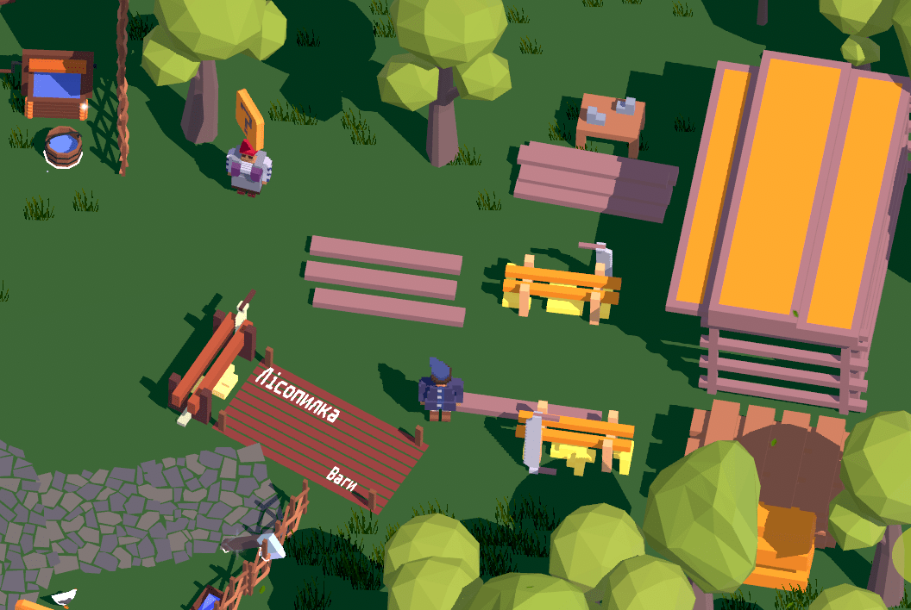
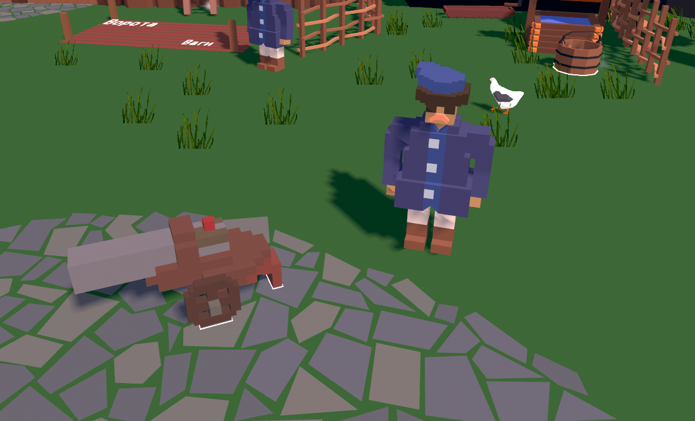
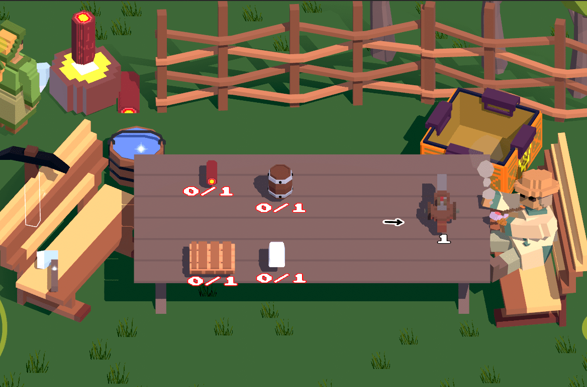
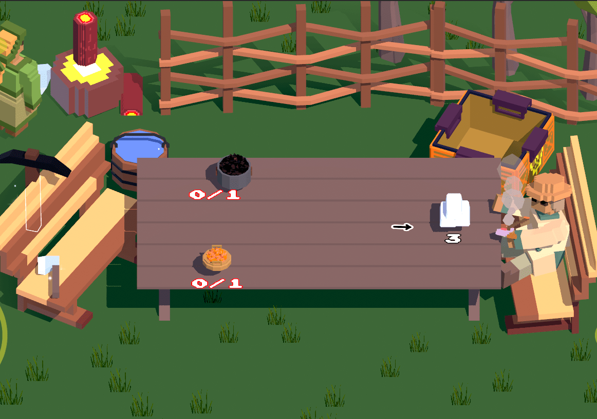
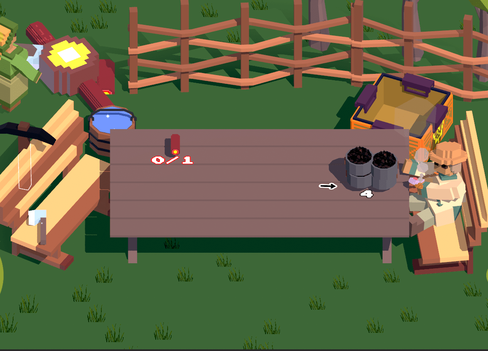

[🇺🇸English](index.md)

[Інші ігри](all_games_uk.md)

# Слобода. Розбудуй селище у Війську Запорізькому

# Про гру

**Колись мріяли пограти за козаків з Війська Запорозького?** Тоді ця гра для вас! Візьміть на себе роль старости нової Слободи, яку тільки-но поставили у Війську Запорізькому. Збирайте ресурси, будуйте будівлі, захоплюйте нові долини та розширюйте вплив Слободи на навколишні землі. Виконуйте більше ніж 30 квестів від допомоги козакам під Азовом і до формування невеликих загонів для рейдів в степу.

Ваша задача збирати ресурси за допомогою кайла та сокири, збудувати нові виробництва та відкрити нові долини, де знаходяться ще більше виробництв, які необхідно збудувати. В грі доступно 17 будівель, 6 долин для розширення селища та 35 завдань, які занурять в життя старости Війська Запорозького в XVII столітті.

## Посилання

- Tiktok

- Twitter: [https://twitter.com/locadeserta](https://twitter.com/locadeserta)
- Telegram: [https://t.me/locadesertachumaki](https://t.me/locadesertachumaki)

## Гра поєднує в собі два жанри

- 🏠розбудуй селище
- ⚒️виробничий симулятор

## Що за жанр розбудуй селище?

Це жанр, де гравці будують селище десь у лісі і починають з примітивних ресурсів, такі як камінь та дерево. Щось на кшталт Майнкрафту, але не від першої особи 😘. Поступово зводячі все нові і більш складні будівлі, гравці постійно відкривають нові будівлі та долини. Загалом в грі доступно для побудови 17 будівель, при чому кожна з них може бути покращена тричі, для збільшення обсягу економіки.

Кожна з будівель має унікальний арт для кожного з рівня покращень.

Наприклад, Лісопилка 🪚:

 ➡️  ➡️ 

## Що за жанр Виробничий симулятор?

У виробничих симуляторах гравець має будувати і забезпечувати виробничі ланцюги на виробництвах.

Наприклад, щоб виготовити гармату , треба метал, дошки, порох та дерево: .

Щоб отримати метал, треба залізо та вугілля:

.

Щоб отрмати залізо, треба їжа для шахтаря:

.

Щоб отримати вугілля, треба дерево для вуглярки:

.

І в кінці виробничого ланцюгу гравець отримує гармату:

## Коли випуск?

Випуск запланований на зиму 2022.

## Які платформи?

Поки що акцент іде на платформи від Apple. Гра буде доступна на iPhone, iPad та Apple TV!

## Підтримка джойстиків 🎮

