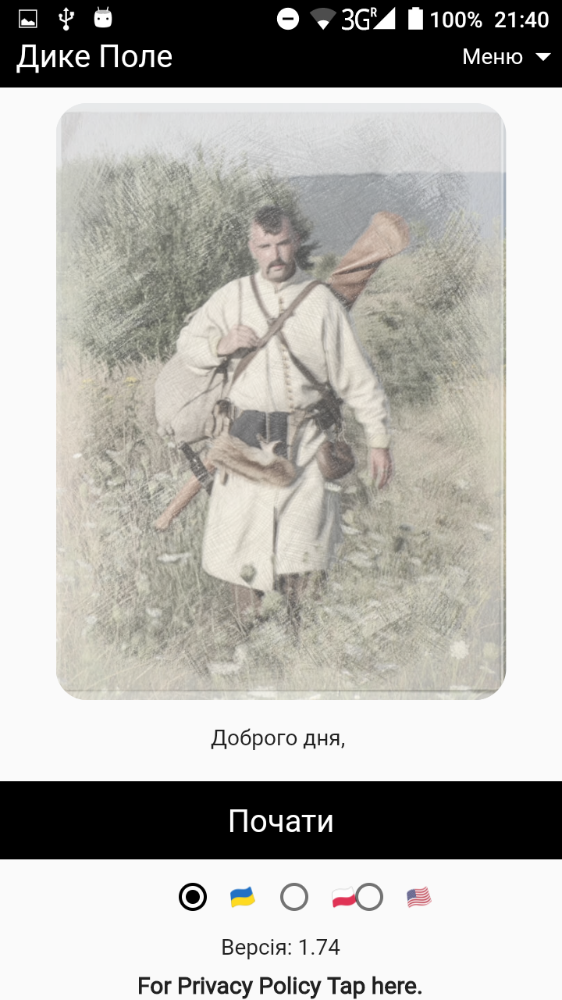
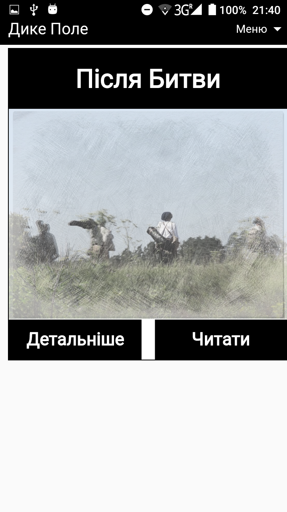
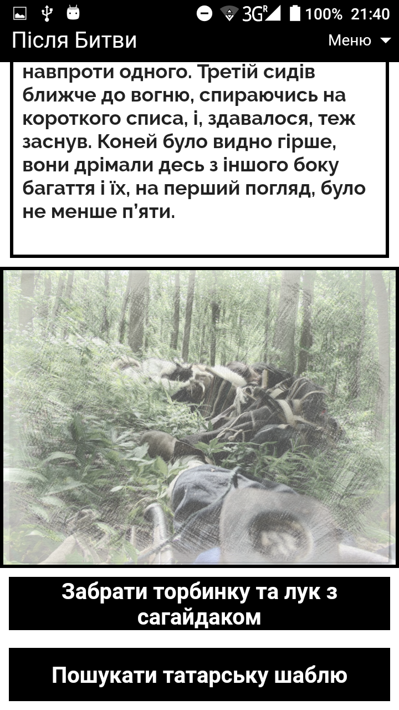
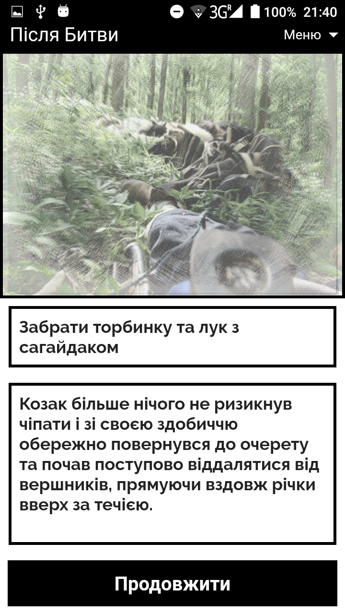

[🇺🇸English](index_en.md)
[🇺🇦Українською](index.md)

# Дике Полe

### Онлайн версія гри знаходиться по посиланню:

<a style="font-size: 36px" href="https://locadeserta.com/game/?lang=uk">Дике Поле: Інтерактивні історії</a>

## Гра, в якій ви можете побудувати свою слободу на Дикому Полі:

<a style="font-size: 36px" href="https://locadeserta.com/citybuilding/">Дике Поле: Слобода</a>

### Гра доступна на Google Play Store та Apple App Store:

# Що це

Loca Deserta – це серія інтерактивних оповідань. Всі вони присвячені різним подіям, які відбувались в Україні в добу козаччини.

## В цьому козацькому альтернативному світі уже доступні дев'ять історій:

- **Хотинська різанина**. Описує нічний рейд козаків до турецьких гармашів. Оснований на згадках німців-найманців, які залишили після себе щоденники.
- **Зустріч у степу**. Описує пригоди козацького загону під час зачистки відступаючих татар після нападу на Канівські землі.
- **Кривава пастка**. Описує знищення карального загону поляків під Жовтими Водами у 1648 році. Ви візьмете участь у влаштуванні засідки на відступаючого ворога і його повного розгрому.
- **Останній бій під Берестечком**. Описує відступ козацьких військ з-під Берестечка. Після зради татар і викрадення гетьмана Хмельницького, козакам довелось відступити. Ви разом з іншими козаками з Переяславського полку візьмете участь у прикритті відходу основних сил у якості козака-смертника.
- **Кодацька ніч**. Події відбуваються в 1635 році, коли гетьман Іван Сулима зруйнував Кодацьку фортецю. Вам доведеться взяти участь в цьому штурмі і провести козаків до перемоги.
- **Переправа**. Козак повертався з уходу, везучи на коні хутра. Рано вранці зібрав пожитки та вирушив назад до слободи. Але він не знав, що за його діями хтось слідкує. Хтось із лісу...
- **Полювання на ведмедя**. Робітники з лісу сповістили, що бачили групу ведмедів. Візьміть участь в охоті на них.
- **Пожежа в степу**. Під час чергування в степу Дмитро побачив куряву. Як виявилося, це татари підпалили степ. Прийміть вірні рішення, щоб зберегти своє життя і життя слободян!
- **Вовча пастка**. Група козаків потрапила в засідку. Одному з них вдалося врятуватися, але нападники вийшли на його слід. В цій історії вам доведеться провести козака додому скрізь небезпеки та можливу смерть.

## Телеграм-бот з усіма доступними історіями: 

Бот: [https://t.me/locadesertabot](https://t.me/locadesertabot)
 
 Читач проходить історію, вибирає різні розвитки подій. Команди бота дуже прості: "/list" покаже список доступних історій. Далі все відбувається інтерактивно. Просто слідкуйте за відповідями бота. Для цього не треба нічого ставити або кудись заходити окремо, все працює прямо в телеграмі.

# Створіть свою власну інтерактивну історію

І веб і мобільна версія гри має редактор історій. Ви можете створити свою власну з вашого мобільного телефону. Всі версії синхронізуються між собою, тож потім ви можете продовжити редагування уже з настільного комп’ютера.

## Гра доступна на Google Play Store та Apple App Store:

## Декілька картинок з гри:

  
  
  
  

