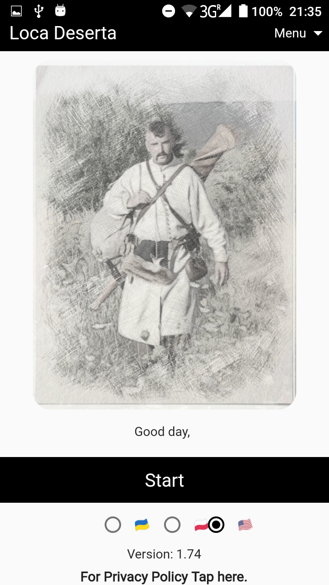
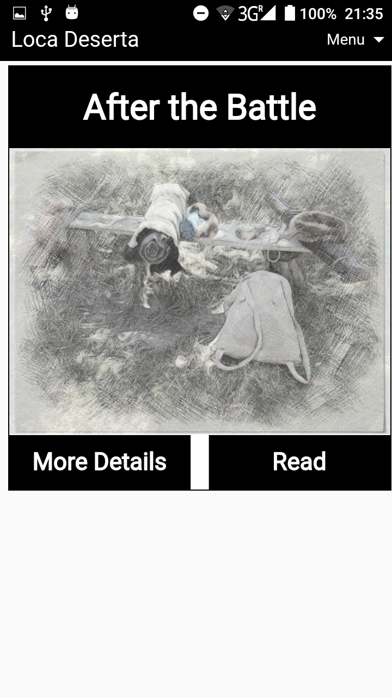
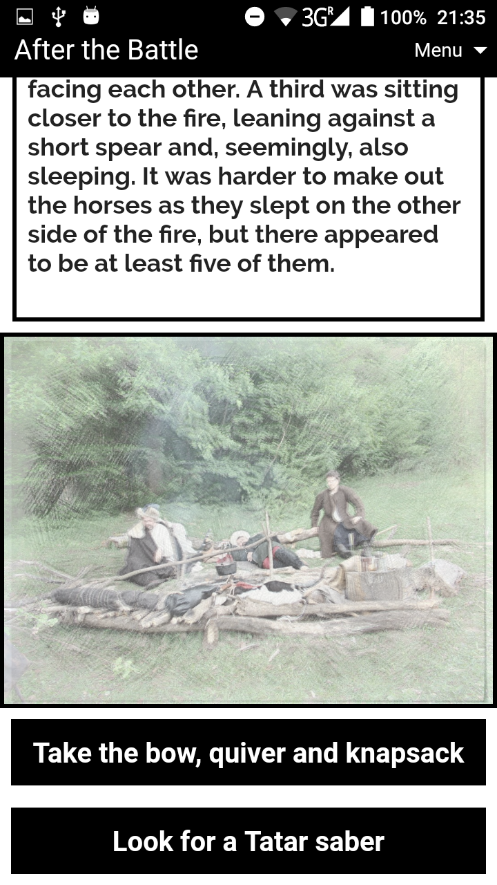
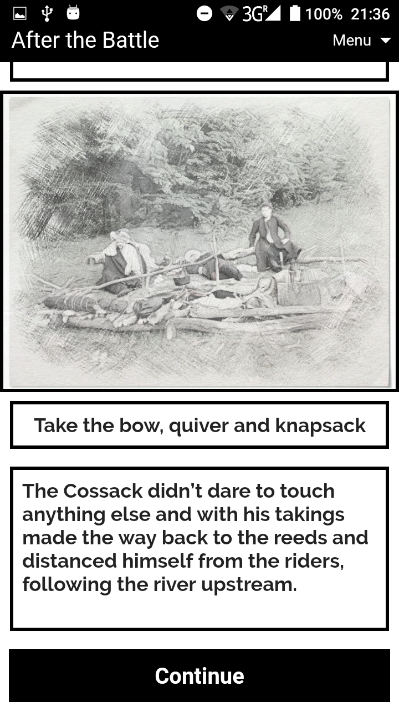

[Main page](../) / [🇺🇦Українською](index.md)

# Loca Deserta

### Online version is available at 

<a style="font-size: 36px" href="https://locadeserta.com/game/?lang=en">Loca Deserta Online</a>

### The game is available in Google Play Store and Apple App Store:

# What's it about

Loca Deserta is an interactive game based on storytelling. All the stories are dedicated to historical
events that happened in Ukraine from the Middle Ages until modern day.

# Available Stories
There is only one story available in English language:

- **After the Battle**. It describes the captive who has to find his way back home after losing a battle at Cicora (1620). The joint Polish-Ukrainian forces were defeated by Osman army. One of the cossacks managed to escape his guards on the way to Crimea. His path comes through the Loca Deserta - hostile rural country laying between the Sich and Crimea. Help me to get home in this 18-way-possible-to-end story.

# Create your own interactive story
Both the web and mobile versions of the game allow users to create stories. You can create your own story on a phone. All the versions of the game are synchronized with each other, so you can continue editing your story on a computer.

## Several images from the game:

  
  
  
  

