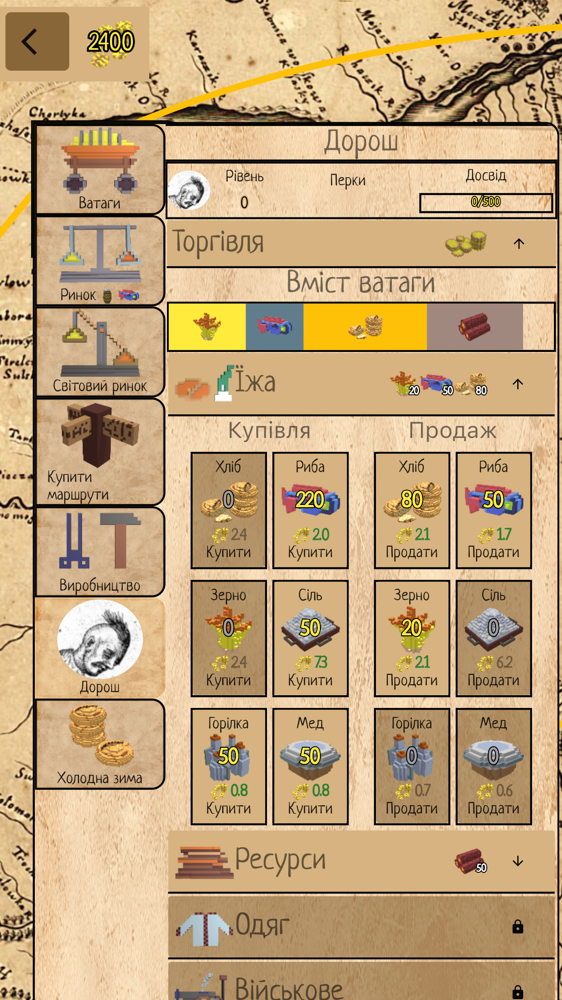

[Головна](../) / [🇺🇸English](index_en.md)

# Дике Поле: Чумаки

Четверта гра з всесвіту [Дике Поле](https://locadeserta.com). Спробуйте себе в ролі торговця в Україні XVII сторіччя!

## Версія для Android:

## Збірка для Windows:

[Зкачайте VC++ Redistributable](https://support.microsoft.com/en-us/topic/the-latest-supported-visual-c-downloads-2647da03-1eea-4433-9aff-95f26a218cc0) пакет перед запуском (скоріш за все у вас він уже є).

Скачайте, розпакуйте архів і запустіть chumaki.exe:
[Збірка для Windows 10](https://github.com/gladimdim/locadeserta/releases/download/universe-1.0/chumaki_windows_1.0.zip)

## Версія для macOS:

Скачайте, розпакуйте архів і запустіть chumaki.app:
[Збірка для macOS](https://github.com/gladimdim/locadeserta/releases/download/universe-1.0/chumaki_macos_1.0.zip)

# Телеграм канал
 Цікаво слідкувати за розробкою цієї гри? Ласкаво прошу на мій телеграм канал: [Розробка ігор з Всесвіту Дикого Поля](https://t.me/locadesertachumaki)

# Ігролад

 

Гру починаєте на Січі. У вас в наявності лише один віз (ватага) і доступ до козацьких міст - Чигирин, Канів, Черкаси та інші. Оцінюйте вартість купівлі/продажу товарів між містами, щоб визначити вдалі для торговлі маршрути. 

## Торгівля і Ринок

 

На ринку можна взнати ціни і наявність товарів в місті.

На Світовому Ринку можна перевірити різницю в ціні між поточним містом і іншими містами на мапі. Це дає змогу перевірити, чи зможете ви щось заробити (і головне - де!) купивши тут товар.

## Отамани

 

Наймайте отаманів, щоб отримувати досвід за продаж товарів. Згодом, досягши нового рівня, ви зможете вибрати перк торгівлі, який відкриває доступ до нових товарів на всіх ринках. Це дає змогу торгувати більш дорогими товарами, а також можливість виконання завдань в містах.

## Виробництво

 

Згодом кількість товарів на ринку буде падати, тому треба будувати виробництва, які дозволяють поповнювати запаси в місті. Кожне з виробництв можна оновити до треттього рівня, що дає змогу отримувати ще більше товарів.

## Події

 

При відвідуванні міста ви можете отримати задачу від городян міста. Всі завдання були створені спеціально для кожного міста, ніякого випадкового генерування ви тут не побачите. За виконання задачі ваш отаман отримує досвід, а також великі кошти. 

## Досягнення

 

В грі є декілька десятків різноманітних досягнень пов'язаних з торгівлею.

## Мапа

 

В грі доступно більше 25 міст. Шукайте гарні місця з центрами виробництва дорогих товарів (шовк, гармати), щоб мати найкращу маржу на торгівлі.
