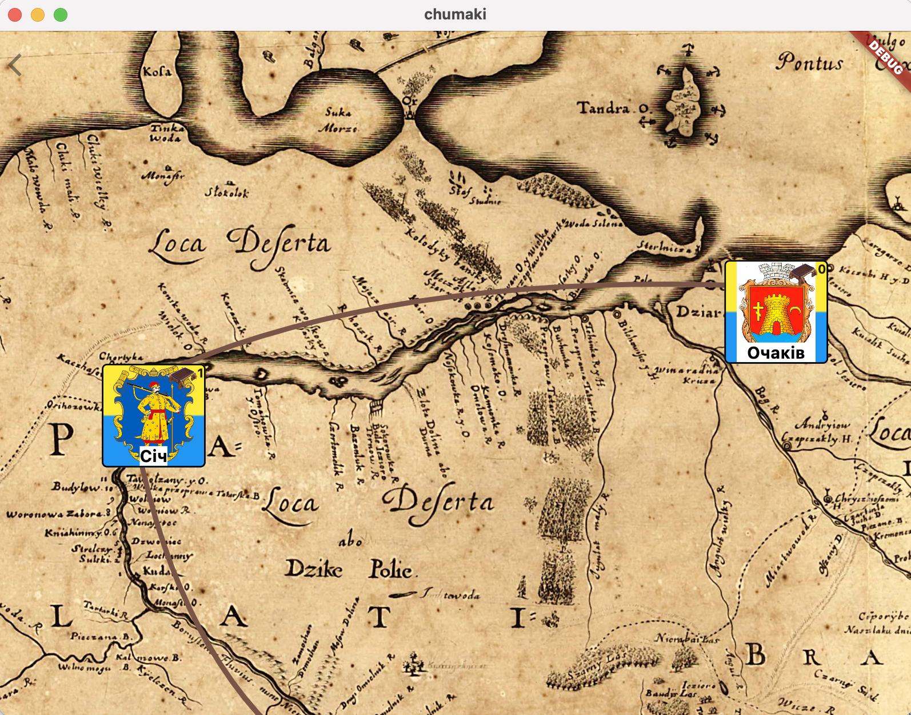

[Головна](../) / [🇺🇸English](index_en.md)

# Дике Поле: Чумаки

Четверта гра з всесвіту [Дике Поле](https://locadeserta.com). Спробуйте себе в ролі торговця в Україні XVII сторіччя!

<a style="font-size: 36px" href="./">Дике Поле: Чумаки
  

 
  

</a>

# Телеграм канал
 Цікаво слідкувати за розробкою цієї гри? Ласкаво прошу на мій телеграм канал: [Розробка ігор на Flutter&Dart](https://t.me/locadesertachumaki)

# Ігролад
Гру починаєте на Січі. У вас в наявності лише один віз (ватага) і доступ до козацьких міст - Чигирин, Канів, Черкаси. Оцінюйте вартість купівлі/продажу товарів між містами, щоб визначити вдалі для торговлі маршрути. 

В шинках за гроші можна купувати маршрути до нових міст, а також слухати плітки і взнавати внутрішню інформацію інших торговців. Згодом, вам стануть більше довіряти в містах і відкривати для вас нові категорії товарів для обміну.

# Дата виходу
Гра планується до запуску осіню 2021 року. На всіх платформах.

# Чернетка опису всього запланованого ігроладу:

Основна канва
Гра заключається в тому, щоб торгувати між різними містами та селищами різними товарами. Кожне місто має свою ціну на продаж та купівлю товарів. Наприклад, південні міста купують за дорого ліс, але продають дешево рибу. Північні ж навпаки, продають дешево ліс, але риба та інші дефіцитні товари купують дорого. За рахунок цього і будується економіка гри.

За основу взята гра Корсари студії Мікролабз.

В грі має бути 20-30 різних міст. Події відбуваються за часів чумацтва, десь 18 сторіччя.

Основні думки щодо ігроладу:
- Міста позначені іконками. Великі міста - церквами.
- Починаєте гру з одного воза
- Можна докупляти вози
- Бартеру немає, весь обмін іде через гривні.
- Віз має обмеження на кількість перевезення
- Міста з'єднанні між собою маршрутами.
- Одразу доступно 5-8 міст для торгівлі.
- Щоб відкрити інші міста треба відвідати край графу, тоді всі його "діти" стають доступні
- В корчмі можна купити маршрути до міст, в яких ви ще не були
- В корчмі можна купити ватажка. Кожен ватажок гарно торгує чимось. Наприклад, єврей гарно продає і купує ювелірні прикраси, татарин - сіль та рибу, українець - порох та коней.
- Кожен віз навантажується якимось товаром і ви потім відправляєте його в якесь місто
- По дорозі ви можете змінити маршрут, щоб він зупинився в якомусь місті де ви можете поторгувати.
- Ватага може бути без ватажка. Тоді немає ніяких бонусів.
- Можна купити ще возів
- Зароблені гроші витрачаються на різні здобутки: госпіталь в Трахтамирові, школи, покращені дороги (швидше їхати), нові вози, заміна волів на більш потужних, торгівля з Кримом потребує разового великого податку.
- Інтерфейс показує всі активні вози, куди і звідки вони їдуть, а також всі проміжні комірки графу (міста) на їх дорозі, щоб ви могли скорегувати
- Якщо постійно торгувати одним і тим самим з містом, то дефіцит пропадає і ціна дуже падає. Це зроблено для того, щоб не було одного маршруту, який самий жирний. Дефіцит відновлюється, якщо поторгувати з іншими містами.
- Ціна фіксується на момент відправки воза у валку.
- Сорочинська або Ніжинська ярмарки. Можна купити туди квиток за деяку суму. Всі товари там мають знижки, ви продаєте з великою націнкою.
- В грі немає війни.
- Великі міста (Київ, Січ), можуть давати тимчасові завдання. Наприклад: Січ потребує гармати чи порох за дуже гарну суму.
- Моровиця: деякі міста можуть стати закритими для торгівлі через мор. Тоді всі маршрути, які пролягають через місто стають закриті. Щоб мор пройшов треба торганути з іншими містами.
	

