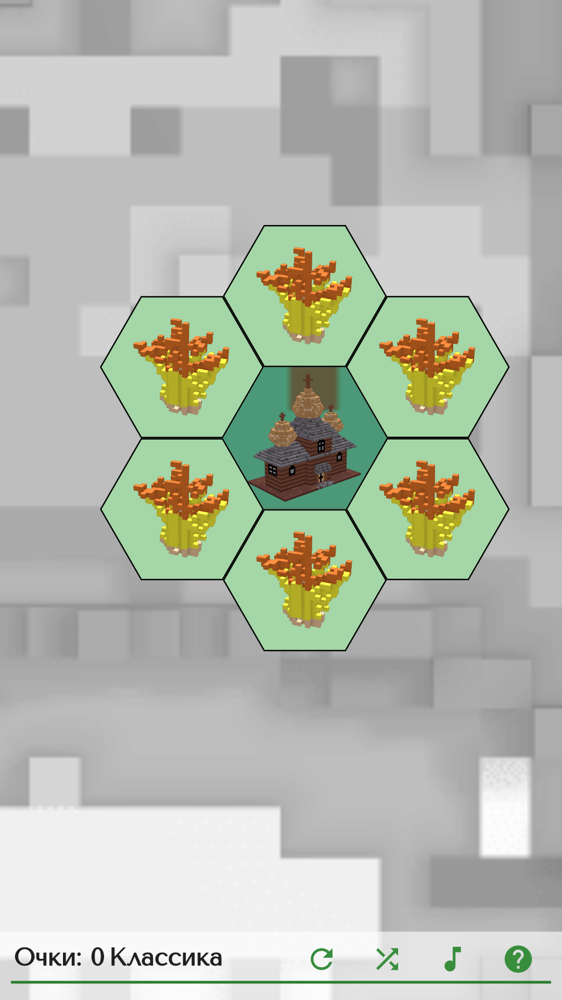
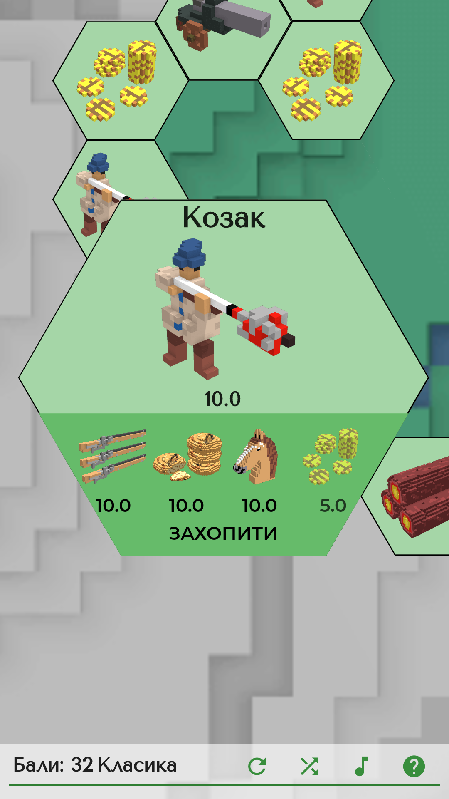
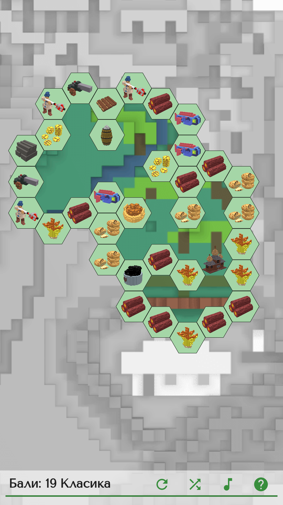
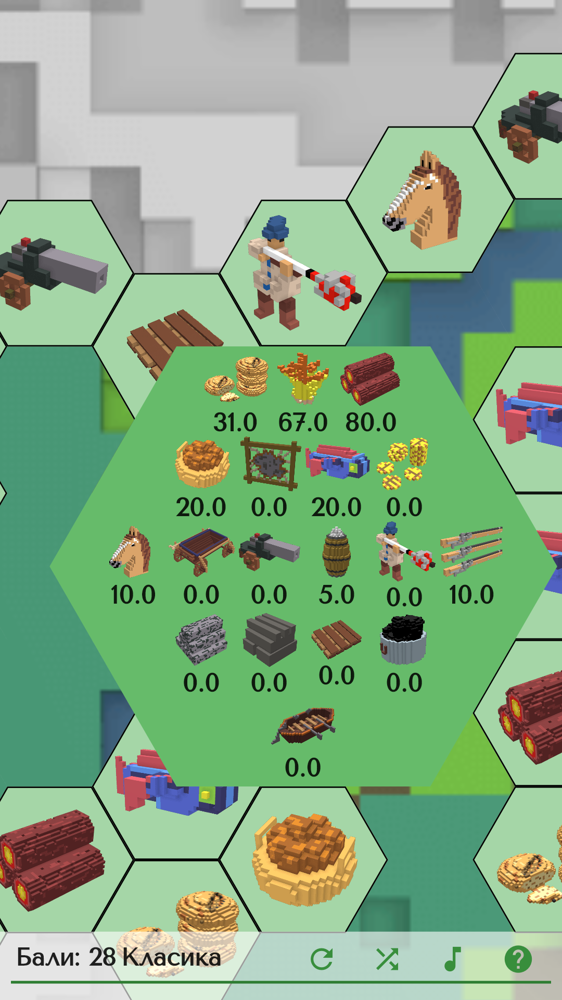
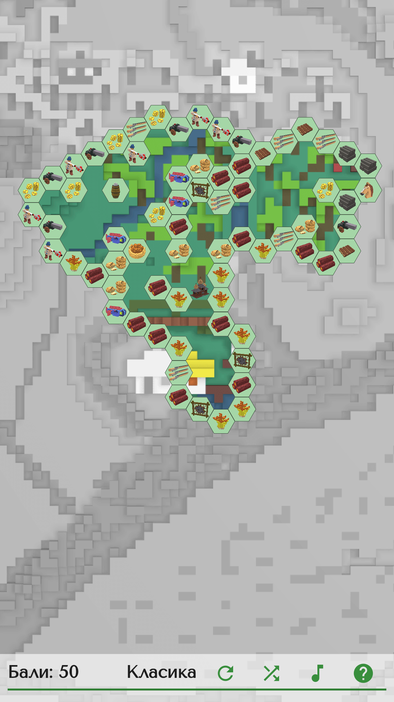
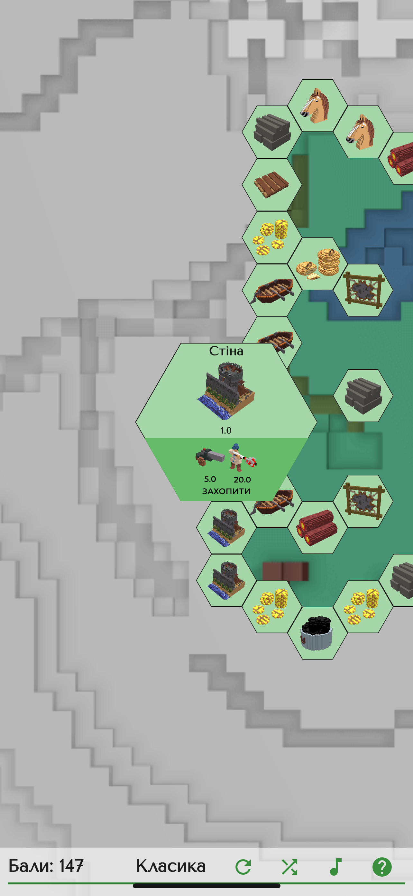
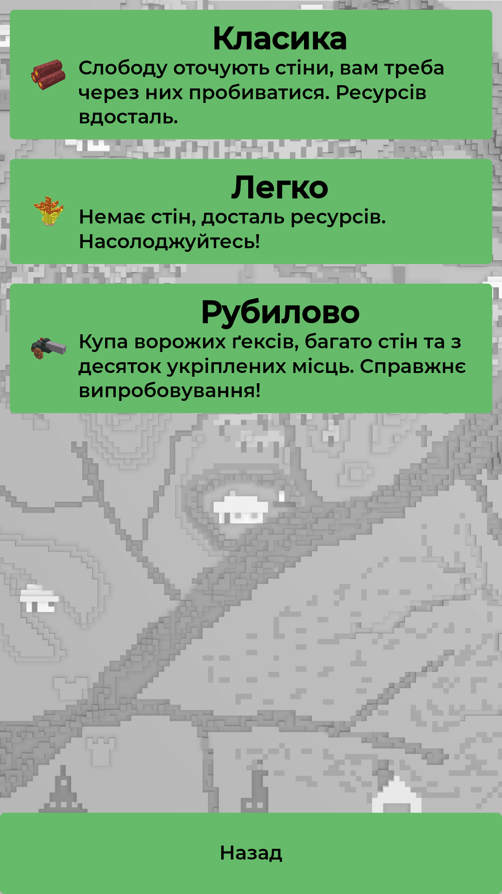

[Головна](../) / [🇺🇸English](index_en.md)

# Дике Поле: Ґекс

Треття гра з всесвіту [Дике Поле](https://locadeserta.com). Спробуйте себе в цьому захопливому пазлі та перевір, скільки зможеш здобути очок!

## Онлайн версія для браузера:

[Дике Поле: Ґекс Онлайн](https://locadeserta.com/hex)

# Ігролад
Гра починається лише з одного ґексу - це центр володінь слободи. Навколо доступно для збору зерно, яке ви можете збирати безкоштовно:

 

Деякі ресурсні гекси можна збирати безкоштовно, інші ж вимагають більш простих ресурсів для збору. Наприклад, козак потребує грошей, їжі, самопала та коня:

 

Кожен захоплений ґекс відкриває сусідні ґекси для захоплення. Доволі швидко ви просунетесь і зможете збирати своє військо.

 

Натиснувши на захоплений ґекс можна подивиться поточний стан економіки:

 

Карта доволі велика

 

Через 15 ґексів ви упретесь в перші перешкоди: ваша слобода оточена кільцем ворожих ґексів. Тут-то і знадобляться всі збудовані гармати, вози, човни та козаки! Також на мапі є ворожі фортеці, які при захоплені дають дуже багато очок

 

Режим гри можна вибрати при старті нової гри:

 

### Розробницький блог:

[Дике Поле. Розробка гри.](https://hashnode.com/series/dike-pole-sloboda-ckhbo21jw04sto0s1e99rhld0)