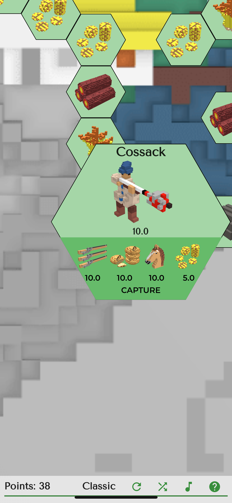
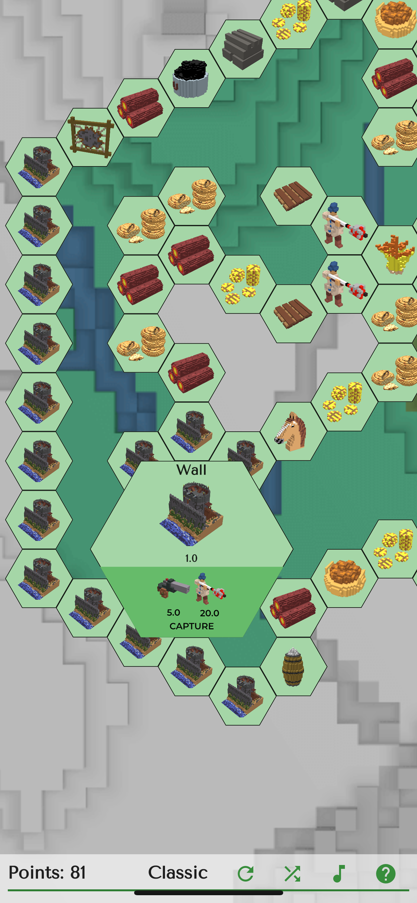

[Main](../) / [🇺🇦Ukraine](index.md)

# Loca Deserta: Hex

Third game in the [Loca Deserta](https://locadeserta.com) universe. Try yourself in this time killer puzzle and see how many points you can get!

# Downloads

## Android

## iOS:

## Online version in browser:

[Loca Deserta: Hex Online](https://locadeserta.com/hex)

# Gameplay
The game starts with only one hex. This is the center of you lands. Around your center you can see the basic resource - grains. Gather it and continue expanding your lands by capturing nearby lands hex by hex.

 

Some resource hexes are gathered for free. The other require other basic resources. For example, the cossack requires food, money, firearm and a horse:

 

Each captured hex openes neighbours. Soon you will start forming your own army:

 

To check what you have just press on any captured hex:

 

The map is really huge:

 

15th level of hexes is formed by enemy hexes: walls. To capture them you now need cannons, carts and boats. Also the map has secrect enemy fortresses. They provide the most points when captured.

 

The game modes can be picked when starting a new game:

 

### Developers blog:

[Loca Deserta; Dev blog.](https://hashnode.com/series/dike-pole-sloboda-ckhbo21jw04sto0s1e99rhld0)