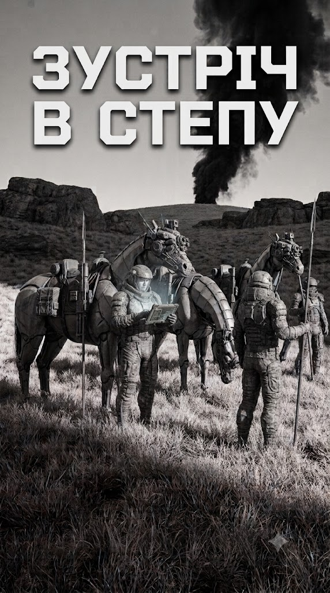

# Зустріч в Степу

[← Назад до всесвіту Дике Поле Sci-Fi](../)

  

## Про книгу

Планета Дике Поле-17. Степ без кінця й краю, де трава ховає сліди важкої техніки, а повітря ще не навчилося тримати людину без респіратора. Богдан Титар, отаман невеликого загону пластунів-розвідників, веде своїх людей у другий рейд тилами Імперії Сонця. Їхня ціль — мельтовіз, що тягне смертоносний вантаж до лінії облоги єдиного міста-вулика на планеті.

Троє вершників на бот-конях, один важкий вогнемет «Шершень» і наказ знищити транспорт будь-якою ціною. Але степ не прощає помилок. Імперські дрони-сканери методично промацують місцевість ультразвуком, розвідники полюють на розвідників, а кожен бій може стати останнім. Коли нічна атака на конвой обертається погонею з повітря, пластунам лишається покладатися тільки на хитрість, швидкість бот-коней і козацьке братерство.

«Зустріч в степу» — це історія про тих, хто воює в тиші степу, далеко від орбітальних ударів і танкових армад. Про тих, чия зброя — терпіння, а перемога — повернутися додому.

## Де читати

- **[Booknet — безкоштовно](https://booknet.ua/book/zustrch-v-stepu-b446432)**
- **[Apple Books](http://books.apple.com/us/book/id6796818751)**
- **[GitHub Releases — EPUB](https://github.com/gladimdim/locadeserta/releases/tag/encounter_in_steppe)**
