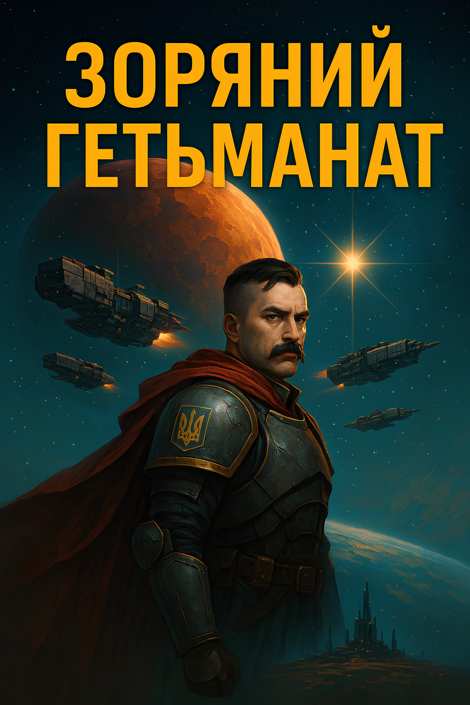
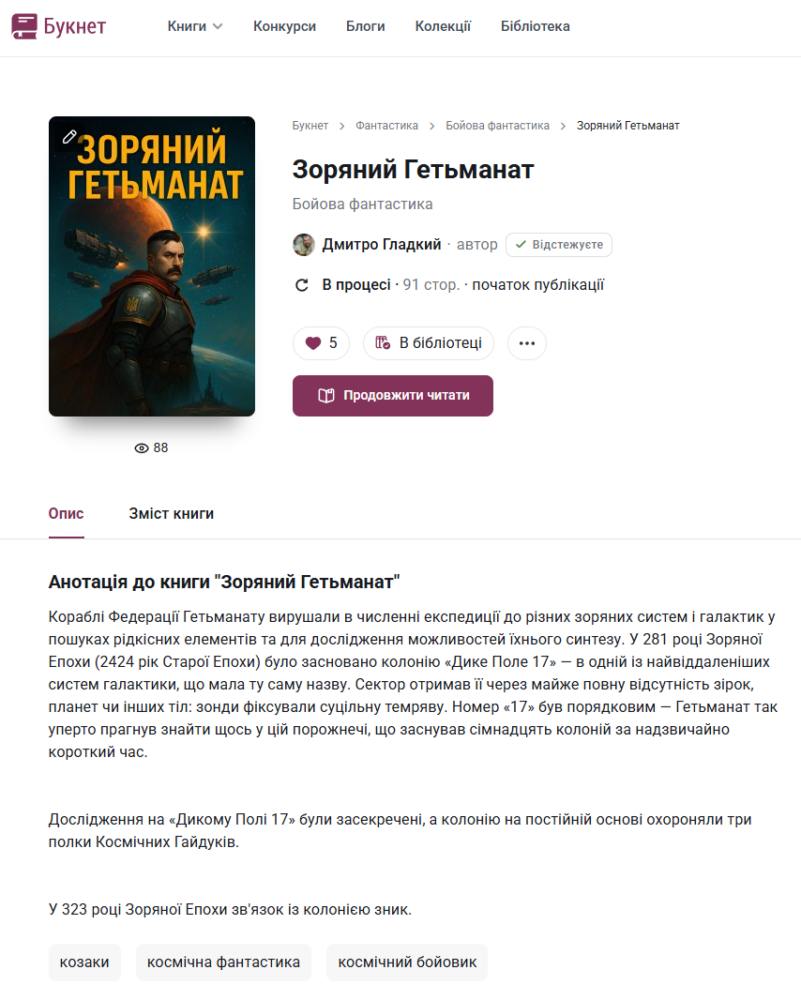
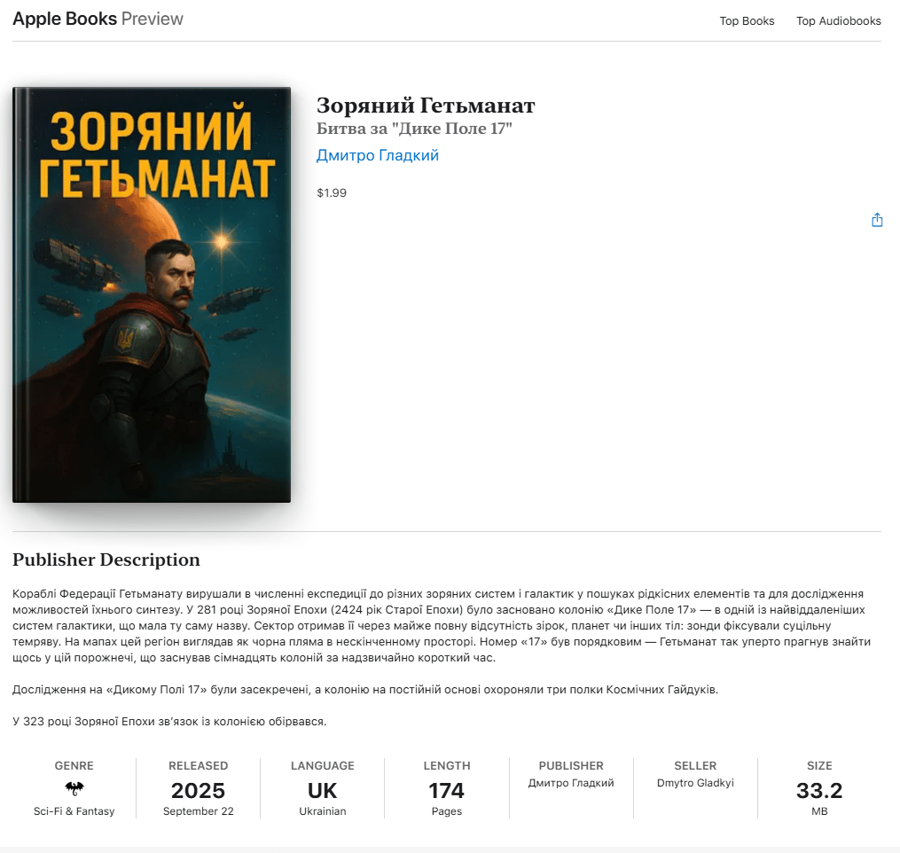

# Всесвіт Дикого Поля Sci-Fi

Здорово, щогли! Вперше публікую свою книгу із всесвіту Дикого Поля Sci-Fi "Зоряний Гетьманат". 

  

## Ви можете читати книгу абсолютно безкоштовно з Booknet: [Зоряний Гетьманат на Booknet](https://booknet.ua/book/zoryanii-getmanat-b442821).

  

## Або придбати на Apple Books (доступно лише за межами України): [Зоряний Гетьманат на Apple Books](https://books.apple.com/us/book/зоряний-гетьманат/id6752848228?ls=1):

  

# Про книгу

Кораблі Федерації Гетьманату вирушали в численні експедиції до різних зоряних систем і галактик у пошуках рідкісних елементів та для дослідження можливостей їхнього синтезу. У 281 році Зоряної Епохи (2424 рік Старої Епохи) було засновано колонію «Дике Поле 17» — в одній із найвіддаленіших систем галактики, що мала ту саму назву. Сектор отримав її через майже повну відсутність зірок, планет чи інших тіл: зонди фіксували суцільну темряву. Номер «17» був порядковим — Гетьманат так уперто прагнув знайти щось у цій порожнечі, що заснував сімнадцять колоній за надзвичайно короткий час.

Дослідження на «Дикому Полі 17» були засекречені, а колонію на постійній основі охороняли три полки Космічних Гайдуків.

# Глава 0. Вступ до всесвіту «Дике Поле  Sci Fi».
Здоров, щоголе! Радий, що ти вирішив завітати до фантастичного всесвіту «Дике Поле Sci-Fi»! Це — перша книга в історії української бойової космічної фантастики. У цій главі ти дізнаєшся про основні історичні події нашого всесвіту.
Щоб тобі було легше орієнтуватися, уяви, що до приходу до влади гетьмана Івана Остаповича Виговського в 1657 році історія у нас і в «Дикому Полі Sci-Fi» була абсолютно ідентичною. Але він не лише зберіг Гетьманат, а й розширив його вплив і території. Згодом інші гетьмани завоювали всю Східну Європу та Балкани.
У XIX столітті сформувалися три імперії, які захопили майже всю Землю. Перша — Імперія Сонця. Вона контролювала весь Азійський континент і Тихий океан (за винятком Австралії). Друга — Корпоративна Республіка. Її влада охоплювала обидві Америки, а Австралія була її васалом. І, нарешті, наша рідна імперія — Федерація Гетьманату. Вона утримувала під контролем усю Європу, Північну Африку, Близький Схід і Малу Азію. Приблизно у XX столітті імперії розпочали війну за контроль над Африкою. Це призвело до взаємних ядерних ударів по угрупованнях на континенті, що зрештою повністю знищило його та зробило непридатним для життя. З метою порятунку ситуації та деескалації конфлікту імперії підписали Мирний ядерний договір, який унеможливлював застосування ядерної зброї на території Землі. Наприкінці XX століття всі три імперії вийшли у космос і почали колонізацію навколишніх планет та супутників.
 
У 2143 році, або у нульовому році Зоряної Ери (ЗЕ), було винайдено варп-двигун, який дозволив подорожувати Сонячною системою за декілька годин, а не за роки чи десятиліття. Надважкий метал Нобелій або Лоренцій став необхідним для здійснення варп-стрибків. Щоб унеможливити війни в космосі, всі три імперії поділили всесвіт — як досліджений, так і недосліджений (чорний космос) — на три сектори. Кожна імперія отримала свій сектор у вічне володіння шляхом жеребкування. Про це розповімо пізніше.
Варп-двигун був винайдений спільно на супутнику Юпітера — Європі. Європа Юпітерна — це дослідницька станція, де вчені з різних імперій та планет разом працювали над створенням варпу. Для стрибка необхідно було мати велике тіло з гравітацією (Юпітер), що могло розігнати реактор з лоренцієм або нобелієм і зім'яти простір, утворивши коридор до іншої точки простору.
Першими трьома міжзоряними гостями були голови відділів розробки варп-двигуна — представники кожної з земних дозоряних імперій. До запуску людей відбулося близько сорока вдалих запусків тварин, рослин та просто предметів. Подорож була запрограмована так, що після двох діб перебування по той бік варпу корабель запускав варп-перехід назад до Пустоші Юпітера. Зібравши достатньо доказів про безпечність варп-переходу та те, що час синхронізований (тварини поверталися не молодшими і не старшими), вирішили відправити перших міжзоряних космонавтів.
Перехід був запрограмований на три доби перебування біля Альфа Центавра з автоматичним поверненням корабля назад. Але у разі вдалого варпу з людьми вони мали повернутися через дві земні доби.
Момент запуску корабля транслювали на всі чотири заселені тіла Сонячної системи: Землю, Марс, Європу та перший штучний супутник Землі. Близько 20 мільярдів людей з усіх імперій стали свідками, як корабель відійшов від Європи Юпітерської та направився до Пустоші Юпітера для стрибка у варп. В самій Пустоші космонавти відправили останній сигнал — «Гайда!» — і зникли з радарів Сонячної системи. Гравітаційна хвиля переходу сколихнула планети, хоча й була зафіксована лише приладами.
Через дві земні доби чергова гравітаційна хвиля вдарила по сенсорах, розставлених навколо Пустоші. І всього за декілька годин Європа Юпітерська отримала відеосигнал із космонавтами. Астрономічний час повернення з варпу і став початком відліку нової Зоряної Епохи, або ЗЕ. Людство отримало доступ до будь-якої зірки.
 
## Марсіанський поділ Всесвіту та Тіґарденський Інцидент.
Кожен член Європейської (Юпітерської) Міжнародної Дослідницької Станції (ЄМДС) отримував доступ до всіх розробок цієї лабораторії. У двадцять третьому році Зоряної Епохи кожна з імперій уже заснувала по одній колонії в найближчій сонячній системі — Альфа Центавра. Пошук наступних систем, здатних приймати людей, показав, що їх доволі мало, а систем із корисними копалинами — ще менше. Також стрибки у варпі були досить дорогими, адже лоренцій та нобелій нестабільні, і їх потрібно тримати лише під мікроядерними вибухами в стані спокою. Між імперіями почалися дискусії щодо того, хто має право розробляти астероїди, комети та планети і створювати там колонії.
У 31 році Зоряної Епохи відбулася перша збройна сутичка під час дослідження системи Зорі Тіґардена — а саме на планетах, придатних для розміщення людей: Тіґарден B та C. Згідно з правилами, хто першим висаджувався на планету, той і отримував її у власність. Китайці з «Імперії Сонця» захопили Тіґарден B, де виявили великі поклади важких металів і планету, більш-менш придатну для життя. Американці з «Корпоративної Республіки» висадилися на Тіґарден C, який виявився абсолютно непридатним для освоєння шматком скелі розміром із півтори Землі. Тому під шумок корпорати захопили беззахисних колоністів на Тіґарден B, убивши їх усіх. Після цього вони сповістили Європу Юпітерську, що зайняли планету Тіґарден B. У той же час Імперія Сонця, зі свого боку, повідомила Європу, що корпорати напали на їхні кораблі в цій системі й захопили пункт керування варпом, фактично вигнавши сонячників.
Цей інцидент увійшов в зоряну історію під назвою «Тіґарденський інцидент». Він спровокував заворушення в Сонячній системі — всі три імперії перейшли в стан неоголошеної війни. Війська Гетьманату, Корпоратів та Імперії Сонця направилися до Європи Юпітерської, щоб захопити керування та розробку варп-переходів. Входження до зони гравітації Європи означало початок першої Сонячної світової війни, адже зона Європи Юпітерської була демілітаризованою.
Голови розробок варп-переходів з Європи Юпітерської — а саме Михайло Сагайдак, Джек Мо (马云) та Річард Столман — виступили із заявою, що будь-який подальший рух з боку будь-якої з імперій з метою захоплення варп-лабораторії спричинить колапс цивілізацій. Працівники дослідницької станції погрожували запустити варп-двигун безпосередньо на Європі Юпітерській, що викличе гравітаційний розрив і знищить супутник разом зі станцією.
Три ударні корпуси імперій зупинилися на кордоні Європи Юпітерської, вагаючись продовжити рух. Для початку перемовин було вирішено провести конференцію на Марсі — щоб остаточно вирішити питання поділу всесвіту та узгодити умови отримання варп-двигунів.
24 липня, 33 року зоряної епохи відбувся Марсіанський Поділ Всесвіту.
Весь всесвіт поділили на три сектори — кожен становив третину умовної сфери, що символізувала просторовий поділ. Розподіл відбувався шляхом жеребкування: кожен імператор витягував квиток із назвою сектора. Як тільки хтось витягував третій квиток певного сектора, той автоматично закріплювався за його імперією у вічне користування.
Першим три квитки витягнув Нік Ріос, імператор Корпоративної Республіки. Вони отримали верхній правий сектор. Між соняшниками та гетьманатами спалахнула запекла боротьба — кожен прагнув отримати "лівий" сектор, адже на "нижньому" розташоване велетенське провалля Великого Пса, майже повністю позбавлене ресурсів. Імператор-Кошовий Тарас Величко та імператор сонячників Ван Ман (王莽) ніяк не могли витягнути третій квиток з "лівим" сектором — п’ять разів поспіль кожен витягував квитки з уже зайнятим космосом. Нарешті, Ван Ман витягнув "лівий" сектор, тим самим надавши своїй імперії право володарювати там, а гетьманати автоматично отримали "нижній" сектор. Хоч гети й були у розпачі, але домовленість була домовленістю.
 
## Результати Марсіанського Поділу Всесвіту 33 року
Основні положення договору про поділ всесвіту.
— Відповідний сектор надавався імперіям у вічне володіння.
— Сонячна система мала стати демілітаризованою, без присутності військ будь-якої з імперій у 100-му році ЗЕ.
— Кожна з імперій зобов’язувалася сплачувати податок на науку Європі Юпітерській для продовження розробок.
— Імперії мали виселитися із Сонячної системи до своїх секторів.
— Імперіям заборонялося вести розробку власних варп-двигунів.
— Уся варп-технологія належала Європі Юпітерській.
— Сонячна система стала демілітаризованою, з населенням близько 5–8 мільярдів.
— Порядок підтримувався Мирними Військами, які підпорядковувалися лише трьом головам лабораторії на Європі Юпітерській.
— Кожна з імперій мала групу представників на Європі Юпітерській.
— Закони імперій не діяли в Сонячній системі.
— Європі Юпітерській заборонялося проводити дослідження чи розробку будь-яких військових технологій.
— Європі Юпітерській заборонялося віддавати перевагу будь-якій з імперій.
Настав час двохсот років безперервного розширення варп-станцій та освоєння космосу трьома імперіями. Людство завоювало всесвіт!
Гетьманат остаточно виселився у 91 році ЗЕ. Зоряна Січ була заснована в надскупченні Діви. Корпорати залишили Сонячну систему у 96 році ЗЕ — «Зоряний Вашингтон» було засновано в надскупченні Кентавра. Імперія Сонця виїхала у 87 році ЗЕ, заснувавши «Зоряний Шанхай» у надскупченні Риби-Кита.
Гетьманат вирушав у численні експедиції до різних зоряних систем і галактик у пошуках рідкісних елементів та для дослідження можливості його синтезу. У 281 році Зоряної Епохи (2424 рік Старої Епохи) було засновано колонію «Дике Поле 17» — в одній із найвіддаленіших систем галактики, що носила ту ж саму назву. Сектор отримав її через майже повну відсутність зірок, планет чи інших тіл — зонди фіксували суцільну темряву. На мапах цей регіон виглядав як чорна пляма в нескінченному просторі. Номер «17» був порядковим — Гетьманат так вперто прагнув знайти щось у цій порожнечі, що заснував сімнадцять колоній за надзвичайно короткий час.
Дослідження на «Дикому Полі 17» були засекречені, а колонію на постійній основі охороняли три полки Космічних Гайдуків.

 У 323 році Зоряної Епохи зв’язок із колонією обірвався.
