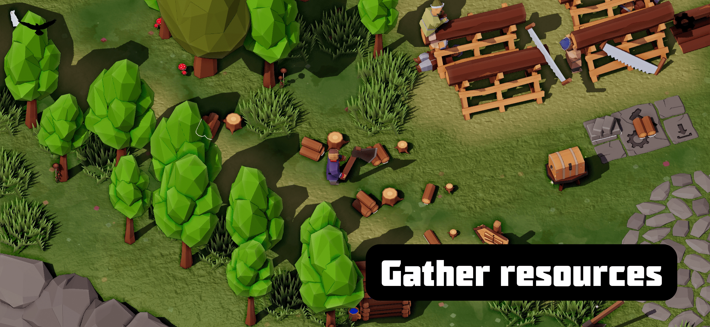
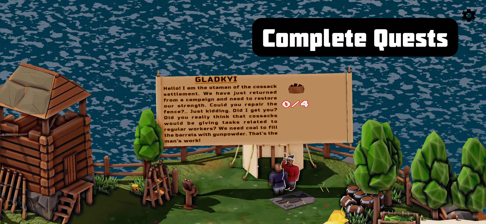
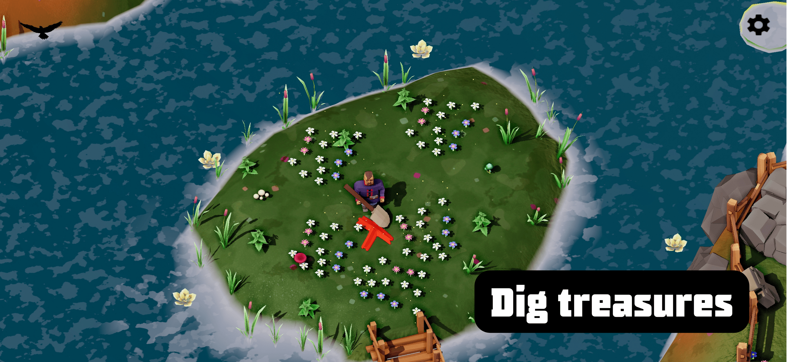

[🇺🇦 Українською](./index_uk.md)

[Other Games](/index.md)

# Loca Deserta: Odesa. Help cossacks settle in Odesa lands!

# About the Game

We are settling the south of Ukraine! In our new game from the “Wild Field” universe. This time you will have to help the settlers in Khadjibey-Odessa.

The game has 100% Ukrainian and English languages support, including voice acting and bombastic Ukrainian songs 🇺🇦.

Take on the role of a simple Cossack who helps build the economy of a new region. Also, find all five treasures hidden on the map

More than 70 quests, from helping the Cossack chieftain restore his strength after a campaign, to helping Budjak Tatars settle in Khadjibey. Quests are interconnected: to complete some quests, you first need to complete tasks of other Cossacks and Cossack womenю

All non-playable characters are interactive. They will tell you about the features of the game, or who is rummaging around the cemetery at night with a candle (hint: they are also looking for treasures ✊🏻).

By completing tasks, you will eventually get information about buried treasures. Take a shovel in your hand and run to dig it up! Then bring it to the center of the island to the Cossack Tomb, where Chieftain collects all Ukrainian artifacts.