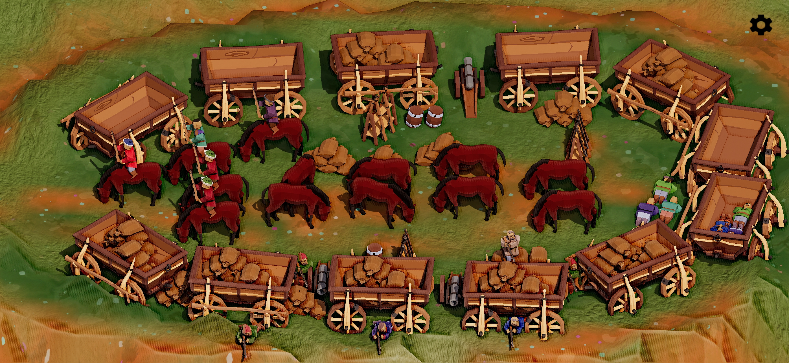

[🇺🇦 Українською](./index_uk.md)

[Other Games](/index.md)

# Loca Deserta: Odesa. Help cossacks settle in Odesa lands!

# About the Game

Welcome to our charming lowpoly settlement, where you become the mighty chieftain in charge of leading it to prosperity! Explore the rugged terrain of southern Ukraine, gather resources, mine stones, and build manufacturings to craft your way to the top. With access to the Black Sea and six valleys to explore, there's no limit to your success!

Upgrade your buildings up to three times to produce more goods, and witness the unique lowpoly art and animation for each manufacturing building. With a total of 47 lowpoly building models, you're in for an immersive and gorgeous gaming experience.

Unlock 21 Game Center achievements with awesome and breathtaking art, and enjoy the sounds of Ukraine with three magnificent Ukrainian songs recorded just for the game. Find bards on the map and listen to their concerts while exploring the wilderness.

Embark on over 40 quests, each offering a unique challenge and guiding you through the intricate gameplay mechanics. The game offers a production chain that's six levels deep, allowing you to produce over 17 types of materials in total. Each valley you unlock provides new opportunities for goods production and lets you produce new types of goods.

The game also supports external controllers, and all buttons are mapped to the controls for a seamless experience. You can even hide all on-screen controls from the menu, taking your gameplay to the next level.

Join our lowpoly settlement, and see if you have what it takes to become a legendary chieftain and lead our town to glory!