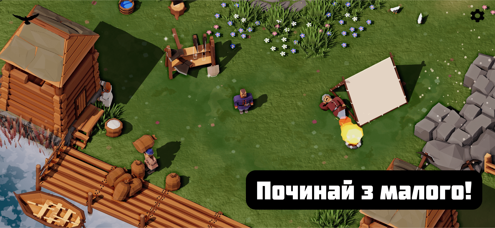
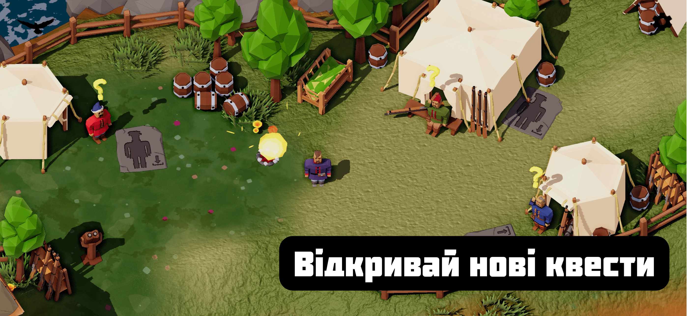
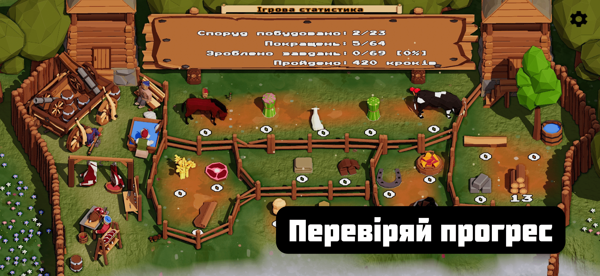
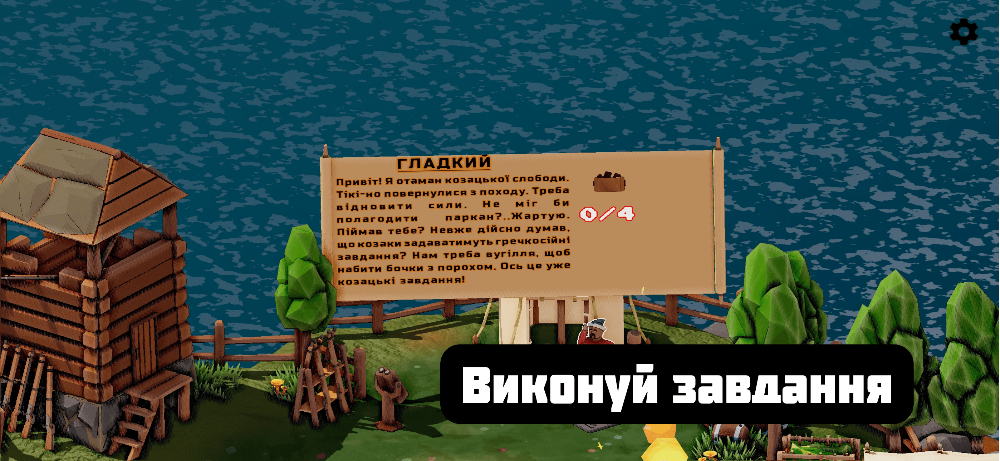
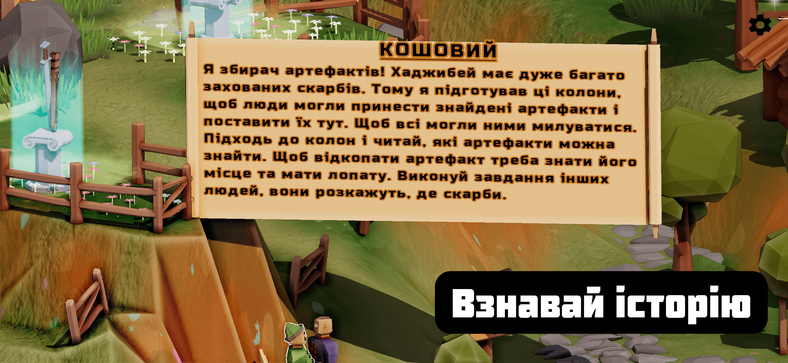

[🇺🇸English](./index.md)

[Інші ігри](/index_uk.md)

# Дике Поле: Одеса. Заселяємо південь України!

# Про гру

Заселяємо південь України! В нашій новій грі із всесвіту "Дике Поле". На цей раз тобі прийдеться допомогти поселенцям в Хаджибеї-Одесі!

Грає має 100% українську мову, включаючи озвучку та бомбічні українські пісні 🇺🇦

Візьміть на себе роль простого козака, який допомогає розбудувати економіку нової області. А також знайди всі п'ять скарбів, які заховані на мапі.

Більше ніж 70 квестів, від допомоги отаману козаків відновити сили після походу, до допомоги буджацьким татарам оселитися в Хаджибеї.

Квести пов'язані між собою: щоб пройти якийсь квест, необхідно спочатку виконати завдання інших козаків та козачок.

Всі неігрові персонажі - інтерактивні. Вони розкажуть тобі про особливості гри, або хто шариться вночі по цвинтарю із свічкою (підказка: шукають скарби теж ✊🏻)

Виконуючи завдання, ти врешті-решт отримаєш інформацію про закопані скарби. Бери лопату в руку і біжи худчіш викопувати його! А потім принось в центр острова на Козацьку Могилу, де Кошовий збирає всі українські артефакти.

Насолоджуйся нашою грою про Україну, а ми працюємо над наступною грою!

