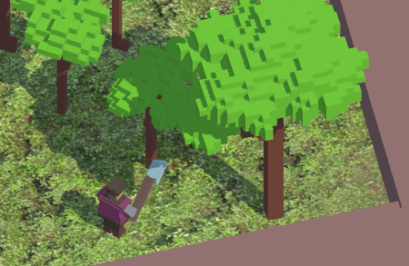
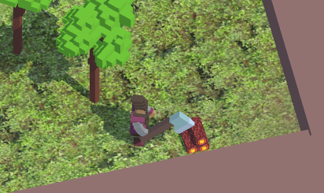
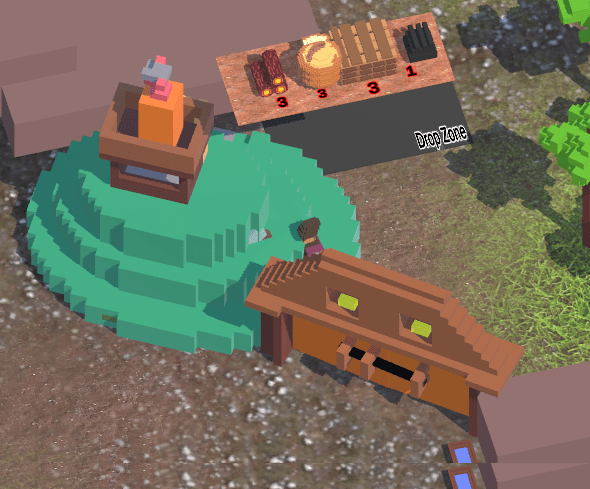
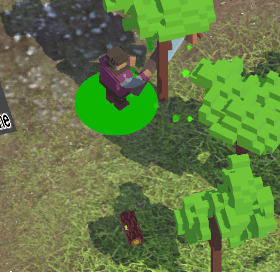

# Loca Deserta: Sloboda 2

This is a remake of [Loca Deserta: Sloboda](https://locadeserta.com/citybuilding/index_en.html) game.

# About the Game

You must build a settlement. You start with just two tools 🪓⛏, a forest 🌲 and some stone🗿. 
Cut the trees, mine stone, build buildings, produce new materials, unlock areas.
Each new area gives you access to new buildings and more resources. Plan accordingly as some of the resources cannot be replenished!
Each new building allows you to produce more complicated materials, like guns, cannons, wagons and boats.
They are used to unlock next areas with more sophisticated production lines.

*The game is heavily inspired by [Unrailed!](https://store.steampowered.com/app/1016920/Unrailed/)*

---

# Dev blog
Follow official telegram channel: [https://t.me/locadesertachumaki](https://t.me/locadesertachumaki) to get daily dev blogs and updates

---
**DEV! WebGL Build**
[https://gladimdim.github.io/Sloboda2_WebGL/](https://gladimdim.github.io/Sloboda2_WebGL/)

---

# Alpha Releases

I am pleased to share with you the alpha builds of my game.

**iOS/Android devices are the main and current target**
Please be patient, soon I will add support for Windows/macOS. You can play on these platforms but all the controls are touch/mouse based!

---
## [Alpha #6, Download links](https://github.com/gladimdim/locadeserta/releases/tag/sloboda-remake-alpha-6)

What's included

- Added bucket tool
- Bucket can be applied to stumps to renew trees
- New separate zones to build and produce
- Dozen of bug fixes

---
## [Alpha #4. Download links](https://github.com/gladimdim/locadeserta/releases/tag/sloboda-remake-alpha-4)

What's included

- 🧈 Butter smooth camera movement.
- 🎥 Enhanced the camera logic to follow player in more natural accelaration
- 🆙 The larger the tree the more logs you cut from it

- 😝 Locked 'free' access to the bottom area 

- Introduced circular progress indicator of the current action

- Increased the lighting strength. The scene has more light
