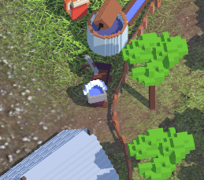
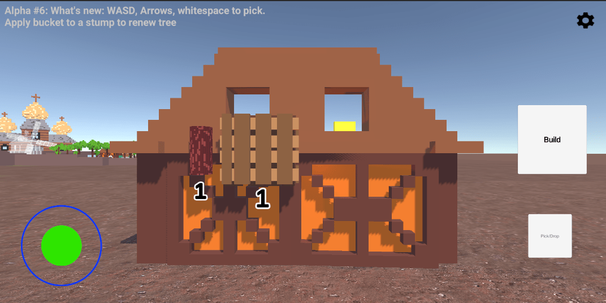
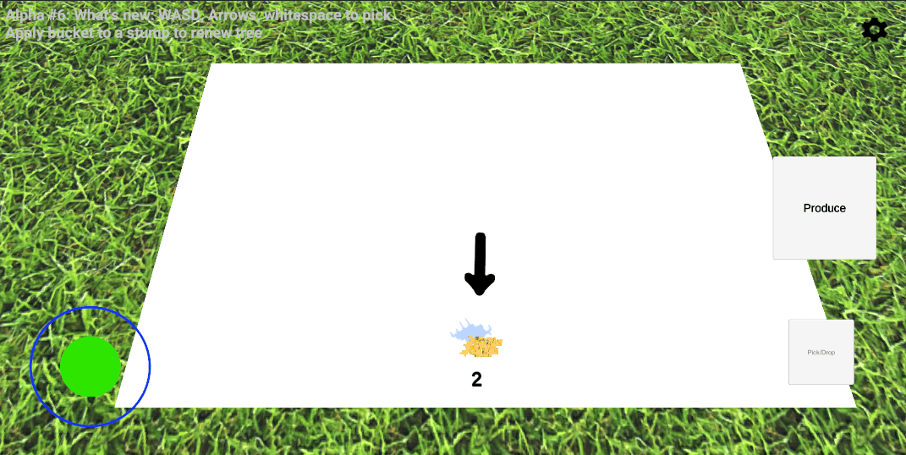

# Loca Deserta: Sloboda 2

This is a remake of [Loca Deserta: Sloboda](https://locadeserta.com/citybuilding/index_en.html) game.

# About the Game

You must build a settlement. You start with just two tools 🪓⛏, a forest 🌲 and some stone🗿. 
Cut the trees, mine stone, build buildings, produce new materials, unlock areas.
Each new area gives you access to new buildings and more resources. Plan accordingly as some of the resources cannot be replenished!
Each new building allows you to produce more complicated materials, like guns, cannons, wagons and boats.
They are used to unlock next areas with more sophisticated production lines.

*The game is heavily inspired by [Unrailed!](https://store.steampowered.com/app/1016920/Unrailed/)*

---

# Discord Server

Join my discord server with lots of screenshots, videos, gameplays, daily news/screenshots and just to chat:
https://discord.gg/5cFhY9XeUR

# Dev blog
Follow official telegram channel: [https://t.me/locadesertachumaki](https://t.me/locadesertachumaki) to get daily dev blogs and updates

# The GDWC

My game has been selected for The Game Development Championship!
Please give it a try and leave a like on the page. This will help to spread the world about it to more people!

[https://thegdwc.com/pages/game.php?game_guid=6b6da42e-9889-4b52-a27e-9b0b6965ee7a](https://thegdwc.com/pages/game.php?game_guid=6b6da42e-9889-4b52-a27e-9b0b6965ee7a)

---
**DEV! WebGL Broken Build**
[https://gladimdim.github.io/Sloboda2_WebGL/](https://gladimdim.github.io/Sloboda2_WebGL/)

---

# Alpha Releases

I am pleased to share with you the alpha builds of my game.

**iOS/Android devices are the main and current target**
Please be patient, soon I will add support for Windows/macOS. You can play on these platforms but all the controls are touch/mouse based!

---

## [Alpha #14, Download link](https://github.com/gladimdim/locadeserta/releases/tag/sloboda-remake-alpha-14)

# Huge content refresh with dozens new particles, effects, animations, fixes and new area with production chain!

What's new:

- 🎠New steppe area. Horses are available for breeding :)

- ` Particles. Everywhere. All actions are now animated or launch particles to engage player
New resource spawn:

Building upgrade:

- New action progress animation:

- All tools and resources (basically anything that is actionable) is now outlined and you will always find it behind buildings or in the deep forest:

- 🆙 Enhanced animations of the production processes
New animation for smeltery:

- 🙄 Gorgeous area unlock animation:

- Jaw-dropping river spline

- 💯🔟 Dozens of bug fixes

- ♻️ Rebalanced EVERYTHING.

I've played my game from 0 to hero for almost 2 hours. Found all 'heavy' production spots and decided to ease the requirements to build/produce as the game should give a joy and not running from one corner to the other...

---
## [Alpha #13, Download link](https://github.com/gladimdim/locadeserta/releases/tag/sloboda-remake-alpha-13)

New huge feature was added: Quests!

Alpha #13 includes:

- ❗Find an NPC with exclamation mark to get quest assignments.

- ⁉️ Quests are designed in such way that players can be gradually introduced to the gameplay mechanics.

- 🏛️🏗️🏢 Dozens of adjustments to 3D models/layout/UI
- ⛔No more free resources scattered around the terrain ;)

## [Alpha #12, Download link](https://github.com/gladimdim/locadeserta/releases/tag/sloboda-remake-alpha-12)

What's included:

- new zone with lake and river

-🎣you can go fishing at lake
-🐟fish spots are depleted, use 🍞bread to restore fish spot
- bug fixes
- new terrain

- performance improvements
- new tool: fishing rod 🎣
- new resource: 🐟
- fixed bucket refill logic

- terrain adjustments

---

## [Alpha #10, Download link](https://github.com/gladimdim/locadeserta/releases/tag/sloboda-remake-alpha-10)

What's new:

- New Animations for Powder Hut production:

- New animations for Smeltery production:

- Buckets visualy represent how much water is inside

- Terrains instead of placeholders:

## [Alpha #9, Download link](https://github.com/gladimdim/locadeserta/releases/tag/sloboda-remake-alpha-9)

Alpha #9 includes several big new features and numerous bug fixes.

New Features:

- Production animation for Coal Maker:

- Production animation for Mill:
- 

- Production Animation for Iron Mine:
- 

- Production animation for Field:

- new Terrains, removed rectangular placeholders:
- 

Bug fixes:
- No more requirements for unlocked Gates
- Corrected output numbers for upgraded buildings
- Removed dummy buckets from map

---
## [Alpha #8, Download link](https://github.com/gladimdim/locadeserta/releases/tag/sloboda-remake-alpha-8)

This alpha build includes translations for all Help NPCs and for UI menus.

Ukrainian:

Polish:

German:

Online WebGL: build: https://gladimdim.github.io/Sloboda2_WebGL/

---

## [Alpha #7, Download links](https://github.com/gladimdim/locadeserta/releases/tag/sloboda-remake-alpha-7)

Includes new feature:

- [x] NPC Helper. Stand near an NPC with "?" mark and read the basic gameplay instructions for each section

- [x] Numerous bug fixes and balance.

---
## [Alpha #6, Download links](https://github.com/gladimdim/locadeserta/releases/tag/sloboda-remake-alpha-6)

What's included

- 10 New Sound Voice Reactions to player actions!
- Added bucket tool

- Bucket can be applied to stumps to renew trees

- New separate zones to build and produce

- Dozen of bug fixes

---
## [Alpha #4. Download links](https://github.com/gladimdim/locadeserta/releases/tag/sloboda-remake-alpha-4)

What's included

- 🧈 Butter smooth camera movement.
- 🎥 Enhanced the camera logic to follow player in more natural accelaration
- 🆙 The larger the tree the more logs you cut from it

- 😝 Locked 'free' access to the bottom area 

- Introduced circular progress indicator of the current action

- Increased the lighting strength. The scene has more light
